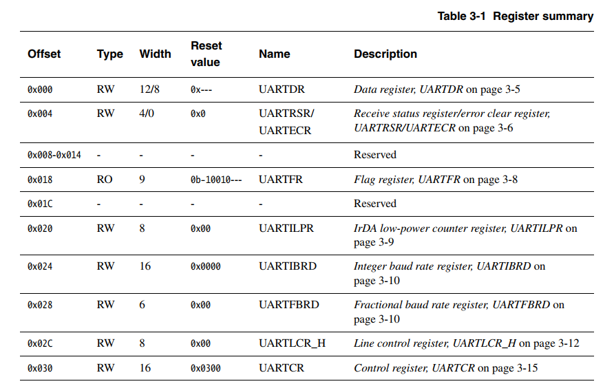

# Driver development for UART

This chapter will concern driver development, a crucial part of bare-metal programming. We will walk through writing a UART driver for the Versatile Express series, but the ambition here is not so much to cover that particular UART in detail as it is to show the general approach and patterns when writing a similar driver. As always with programming, there is a lot that can be debated, and there are parts that can be done differently. Starting with a UART driver specifically has its advantages. UARTs are very common peripherals, they're much simpler than other serial buses such as SPI or I2C, and the UART pretty much corresponds to standard input/output when run in QEMU.

# Doing the homework

Writing a peripheral driver is not something you should just jump into. You need to understand the device itself, and how it integrates with the rest of the hardware. If you start coding off the hip, you're likely to end up with major design issues, or just a driver that mysteriously fails to work because you missed a small but crucial detail. Thinking before doing should apply to most programming, but driver programming is particularly unforgiving if you fail to follow that rule.

Before writing a peripheral device driver, we need to understand, in broad strokes, the following about the device:

* How it performs its function(s). Whether it's a communication device, a signal converter, or anything else, there are going to be many details of how the device operates. In the case of a UART device, some of the things that fall here are, what baud rates does it support? Are there input and output buffers? When does it sample incoming data?

* How it is controlled. Most of the time, the peripheral device will have several registers, writing and reading them is what controls the device. You need to know what the registers do.

* How it integrates with the hardware. When the device is part of a larger system, which could be a system-on-a-chip or a motherboard-based design, it somehow connects to the rest of the system. Does the device take an external input clock and, if so, where from? Does enabling the device require some other system conditions to be met? The registers for controlling the device are somehow accessible from the CPU, typically by being mapped to a particular memory address. From a CPU perspective, registers that control peripherals are *Special Function Registers* (SFR), though not all SFRs correspond to peripherals.

Let's then look at the UART of the Versatile Express and learn enough about it to be ready to create the driver.

## Basic UART operation

UART is a fairly simple communications bus. Data is sent out on one wire, and received on another. Two UARTs can thus communicate directly, and there is no clock signal or synchronization of any kind, it's instead expected that both UARTs are configured to use the same baud rate. UART data is transmitted in packets, which always begin with a start bit, followed by 5 to 9 data bits, then optionally a parity bit, then 1 or 2 stop bits. A packet could look like this:

```
+-------+---+---+---+---+---+---+---+---+---+---+
| Start | 0 | 1 | 2 | 3 | 4 | 5 | 6 | 7 | P | S |
| bit   |   |   |   |   |   |   |   |   |   |   |
|       |   |   |   |   |   |   |   |   |   |   |
+-------+---+---+---+---+---+---+---+---+---+---+
```

A pair of UARTs needs to use the same frame formatting for successful communication. In practice, the most common format is 8 bits of data, no parity bit, and 1 stop bit. This is sometimes written as `8-N-1` in shorthand, and can be written together with the baud rate like `115200/8-N-1` to describe a UART's configuration.

On to the specific UART device that we have. The Versatile Express hardware series comes with the PrimeCell UART PL011, the [reference manual](http://infocenter.arm.com/help/index.jsp?topic=/com.arm.doc.ddi0183g/index.html) is also available from the ARM website. Reading through the manual, we can see that the PL011 is a typical UART with programmable baud rate and packet format settings, that it supports infrared transmission, and FIFO buffers both for transmission and reception. Additionally there's Direct Memory Access (DMA) support, and support for hardware flow control. In the context of UART, hardware flow control means making use of two additional physical signals so that one UART can inform another when it's ready to send, or ready to receive, data.

## Key PL011 registers

The PL011 UART manual also describes the registers that control the peripheral, and we can identify the most important registers that our driver will need to access in order to make the UART work. We will need to work with:

* Data register (DR). The data received, or to be transmitted, will be accessed through DR.

* Receive status / error clear register (RSRECR). Errors are indicated here, and the error flag can also be cleared from here.

* Flag register (FR). Various flags indicating the UART's status are collected in FR.

* Integer baud rate register (IBRD) and Fractional baud rate register (FBRD). Used together to set the baud rate.

* Line control register (LCR_H). Used primarily to program the frame format.

* Control register (CR). Global control of the peripheral, including turning it on and off.

In addition, there are registers related to interrupts, but we will begin by using polling, which is inefficient but simpler. We will also not care about the DMA feature.

As is often the case, reading register descriptions in the manual also reveals some special considerations that apply to the particular hardware. For example, it turns out that writing the IBRD or FBRD registers will not actually have any effect until writing the LCR_H - so even if you only want to update IBRD, you need to perform a sequence of two writes, one to IBRD and another to LCR_H. It is very common in embedded programming to run into such special rules for reading or writing registers, which is one of the reasons reading the manual for the device you're about to program is so important.

## PL011 - Versatile Express integration

Now that we are somewhat familiar with the PL011 UART peripheral itself, it's time to look at how integrates with the Versatile Express hardware. The VE hardware itself consists of a motherboard and daughter board, and the UARTs are on the motherboard, which is called the Motherboard Express µATX and of course has [its own reference manual](http://infocenter.arm.com/help/topic/com.arm.doc.dui0447j/DUI0447J_v2m_p1_trm.pdf).

One important thing from the PL011 manual is the reference clock, UARTCLK. Some peripherals have their own independent clock, but most of them, especially simpler peripherals, use an external reference clock that is then often divided further as needed. For external clocks, the peripheral's manual cannot provide specifics, so the information on what the clock is has to be found elsewhere. In our case, the motherboard's documentation has a separate section on clocks (*2.3 Clock architecture* in the linked PDF), where we can see that UARTs are clocked by the OSC2 clock from the motherboard, which has a frequency of 24 MHz. This is very convenient, we will not need to worry about the reference clock possibly having different values, we can just say it's 24 MHz.

Next we need to find where the UART SFRs are located from the CPU's perspective. The motherboard's manual has memory maps, which differ depending on the daughter board. We're using the CoreTile Express A9x4, so it has what the manual calls the *ARM Legacy memory map* in section 4.2. It says that the address for UART0 is `0x9000`, using SMB (System Memory Bus) chip select CS7, with the chip select introducing an additional offset that the daughter board defines. Then it's on to the [CoreTile Express A9x4 manual](http://infocenter.arm.com/help/topic/com.arm.doc.dui0448i/DUI0448I_v2p_ca9_trm.pdf), which explains that the board's memory controller places most motherboard peripherals under CS7, and in *3.2 Daughterboard memory map* we see that CS7 memory mappings for accessing the motherboard's peripherals start at `0x10000000`. Thus the address of UART0 from the perspective of the CPU running our code is CS7 base `0x10000000` plus an offset of `0x9000`, so `0x10009000` is ultimately the address we need.

Yes, this means that we have to check two different manuals just to find the peripheral's address. This is, once again, nothing unusual in an embedded context.

# Writing the driver

## What's in the box?

In higher-level programming, you can usually treat drivers as a black box, if you even give them any consideration. They're there, they do things with hardware, and they only have a few functions you're exposed to. Now that we're writing a driver, we have to consider what it consists of, the things we need to implement. Broadly, we can say that a driver has:

* An initialization function. It starts the device, performing whatever steps are needed. This is usually relatively simple.

* Configuration functions. Most devices can be configured to perform their functions differently. For a UART, programming the baud rate and frame format would fall here. Configuration can be simple or very complex.

* Runtime functions. These are the reason for having the driver in the first place, the interesting stuff happens here. In the case of UART, this means functions to transmit and read data.

* A deinitialization function. It turns the device off, and is quite often omitted.

* Interrupt handlers. Most peripherals have some interrupts, which need to be handled in special functions called interrupt handlers, or interrupt service routines. We won't be covering that for now.

Now we have a rough outline of what we need to implement. We will need code to start and configure the UART, and to send and receive data. Let's get on with the implementation.

## Exposing the SFRs

We know by now that programming the UART will be done by accessing the SFRs. It is possible, of course, to access the memory locations directly, but a better way is to define a C struct that reflects what the SFRs look like. We again refer to the PL011 manual for the register summary. It begins like this:



Looking at the table, we can define it in code as follows:

```
typedef volatile struct __attribute__((packed)) {
    uint32_t DR;                /* 0x0 Data Register */
    uint32_t RSRECR;            /* 0x4 Receive status / error clear register */
    uint32_t _reserved0[4];     /* 0x8 - 0x14 reserved */
    const uint32_t FR;          /* 0x18 Flag register */
    uint32_t _reserved1;        /* 0x1C reserved */
    uint32_t ILPR;              /* 0x20 Low-power counter register */
    uint32_t IBRD;              /* 0x24 Integer baudrate register */
    uint32_t FBRD;              /* 0x28 Fractional baudrate register */
    uint32_t LCRH;              /* 0x2C Line control register */
    uint32_t CR;                /* 0x30 Control register */
} uart_registers;
```

There are several things to note about the code. One is that it uses fixed-size types like `uint32_t`. Since the C99 standard was adopted, C has included the `stdint.h` header that defines exact-width integer types. So `uint32_t` is guaranteed to be a 32-bit type, as opposed to `unsigned int`, for which there is no guaranteed fixed size. The layout and size of the SFRs is fixed, as described in the manual, so the struct has to match in terms of field sizes.

For the same reason, `__attribute__((packed))` is provided. Normally, the compiler is allowed to insert padding between struct fields in order to align the whole struct to some size suited for the architecture. Consider the following example:

```
typedef struct {
    char a; /* 1 byte */
    int b;  /* 4 bytes */
    char c; /* 1 byte */
} example;
```

If you compile that struct for a typical x86 system where `int` is 4 bytes, the compiler will probably try to align the struct to a 4-byte boundary, and align the individual members to such a boundary as well, inserting 3 bytes after `a` and another 3 bytes after `c`, giving the struct a total size of 12 bytes.

When working with SFRs, we definitely don't want the compiler to insert any padding bytes or take any other liberties with the code. `__attribute__((packed))` is a GCC attribute (also recognized by some other compilers like clang) that tells the compiler to use the struct as it is written, using the least amount of memory possible to represent it. Forcing structs to be packed is generally not a great idea when working with "normal" data, but it's very good practice for structs that represent SFRs.

Sometimes there might be reserved memory locations between various registers. In our case of the PL011 UART, there are reserved bytes between the `RSRECR` and `FR` registers, and four more after `FR`. There's no general way in C to mark such struct fields as unusable, so giving them names like `_reserved0` indicates the purpose. In our struct definition, we define `uint32_t _reserved0[4];` to skip 16 bytes, and `uint32_t _reserved1;` to skip another 4 bytes later.

Some SFRs are read-only, like the `FR`, in which case it's helpful to declare the corresponding field as `const`. Attempts to write a read-only register would fail anyway (the register would remain unchanged), but marking it as `const` lets the compiler check for attempts to write the register.

Having defined a struct that mimics the SFR layout, we can create a static variable in our driver that will point to the UART0 device:

```
static uart_registers* uart0 = (uart_registers*)0x10009000u;
```

A possible alternative to the above would be to declare a macro that would point to the SFRs, such as `#define UART0 ((uart_registers*)0x10009000u)`. That choice is largely a matter of preference.

## Initializing and configuring the UART

Let's now write `uart_configure()`, which will initialize and configure the UART. For some drivers you might want a separate `init` function, but a `uart_init()` here wouldn't make much sense, the device is quite simple. The functionitself is not particularly complex either, but can showcase some patterns.

First we need to define a couple of extra types. For the return type, we want something that can indicate failure or success. It's very useful for functions to be able to indicate success or failure, and driver functions can often fail in many ways. Protecting against possible programmer errors is of particular interest - it's definitely possible to use the driver incorrectly! So one of the approaches is to define error codes for each driver (or each driver type perhaps), like the following:

```
typedef enum {
        UART_OK = 0,
        UART_INVALID_ARGUMENT_BAUDRATE,
        UART_INVALID_ARGUMENT_WORDSIZE,
        UART_INVALID_ARGUMENT_STOP_BITS,
        UART_RECEIVE_ERROR,
        UART_NO_DATA
} uart_error;
```

A common convention is to give the success code a value of `0`, and then we add some more error codes to the enumeration. Let's use this `uart_error` type as the return type for our configuration function.

Then we need to pass some configuration to the driver, in order to set the baud rate, word size, etc. One possibility is to define the following struct describing a config:

```
typedef struct {
    uint8_t     data_bits;
    uint8_t     stop_bits;
    bool        parity;
    uint32_t    baudrate;
} uart_config;
```

This approach, of course, dictates that `uart_configure` would take a parameter of the `uart_config` type, giving us:

```
uart_error uart_configure(uart_config* config)
```

There are other possible design choices. You could omit the struct, and just pass in multiple parameters, like `uart_configure(uint8_t data_bits, uint8_t stop_bits, bool parity, unit32_t baudrate)`. I prefer a struct because those values logically belong together. Yet another option would be to have separate functions per parameter, such as `uart_set_baudrate` and `uart_set_data_bits`, but I think that is a weaker choice, as it can create issues with the order in which those functions are called.

On to the function body. You can see the entire source in the [corresponding file for this chapter](../src/06_uart/src/uart_pl011.c), and here I'll go through it block by block.

First, we perform some validation of the configuration, returning the appropriate error code if some parameter is outside the acceptable range.

```
    if (config->data_bits < 5u || config->data_bits > 8u) {
        return UART_INVALID_ARGUMENT_WORDSIZE;
    }
    if (config->stop_bits == 0u || config->stop_bits > 2u) {
        return UART_INVALID_ARGUMENT_STOP_BITS;
    }
    if (config->baudrate < 110u || config->baudrate > 460800u) {
        return UART_INVALID_ARGUMENT_BAUDRATE;
    }
```

UART only allows 5 to 8 bits as the data size, and the only choices for the stop bit is to have one or two. For the baudrate check, we just constrain the baudrate to be between two standard values.

With validation done, the rest of the function essentially follows the PL011 UART's manual for how to configure it. First the UART needs to be disabled, allowed to finish an ongoing transmission, if any, and its transmit FIFO should be flushed. Here's the code:

```
    /* Disable the UART */
    uart0->CR &= ~CR_UARTEN;
    /* Finish any current transmission, and flush the FIFO */
    while (uart0->FR & FR_BUSY);
    uart0->LCRH &= ~LCRH_FEN;
```

Having a similar `while` loop is common in driver code when waiting on some hardware process. In this case, the PL011's `FR` has a BUSY bit that indicates if a transmission is ongoing. Setting the FEN bit in `LCRH` to `0` is the way to flush the transmit queue.

What about all those defines like `CR_UARTEN` in the lines above though? Here they are from the corresponding header file:

```
#define FR_BUSY         (1 << 3u)
#define LCRH_FEN        (1 << 4u)
#define CR_UARTEN       (1 << 0u)
```

Typically, one SFR has many individual settings, with one setting often using just one or two bits. The locations of the bits are always in the corresponding manual, but using them directly doesn't make for the most readable code. Consider `uart0->CR &= ~(1u)` or `while (uart0->FR & (1 << 3u))`. Any time you read such a line, you'd have to refer to the manual to check what the bit or mask means. Symbolic names make such code much more readable, and here I use the pattern of `SFRNAME_BITNAME`, so `CR_UARTEN` is the bit called `UARTEN` in the `CR` SFR. I won't include more of those defines in this chapter, but they're all in the [full header file](../src/06_uart/src/uart_pl011.h).

---
**NOTE**

Bit manipulation is usually a very important part of driver code, such as the above snippet. Bitwise operators and shift operators are a part of C, and I won't be covering them here. Hopefully you're familiar enough with bit manipulation to read the code presented here. Just in case though, this cheat sheet might be handy:

Assuming that `b` is one bit,

`x |= b` sets bit `b` in `x`
`x &= ~b` clears bit `b` in `x`
`x & b` checks if `b` is set

One bit in position `n` can be conveniently written as `1` left-shifted `n` places. E.g. bit 4 is `1 << 4` and bit 0 is `1 << 0`
---

Next we configure the UART's baudrate. This is another operation that translates to fairly simple code, but requires a careful reading of the manual. To obtain a certain baudrate, we need to divide the (input) reference clock with a certain divisor value. The divisor value is stored in two SFRs, `IBRD` for the integer part and `FBRD` for the fractional part. Accordig to the manual, `baudrate divisor = reference clock / (16 * baudrate)`. The integer part of that result is used directly, and the fractional part needs to be converted to a 6-bit number `m`, where `m = integer((fractional part * 64) + 0.5)`. We can translate that into C code as follows:

```
    double intpart, fractpart;
    double baudrate_divisor = (double)refclock / (16u * config->baudrate);
    fractpart = modf(baudrate_divisor, &intpart);

    uart0->IBRD = (uint16_t)intpart;
    uart0->FBRD = (uint8_t)((fractpart * 64u) + 0.5);
```

It's possible to obtain the fractional part with some arithmetics, but we can just use the standard C `modf` function that exists for that purpose and is available after including `<math.h>`. While we cannot use the entire C standard library on bare-metal without performing some extra work, mathematical functions do not require anything extra, so we can use them.

Since our reference clock is 24 MHz, as we established before, the `refclock` variable is `24000000u`. Assuming that we want to set a baudrate of `9600`, first the `baudrate_divisor` will be calculated as `24000000 / (16 * 9600)`, giving `156.25`. The `modf` function will helpfully set `intpart` to `156` and `fractpart` to `0.25`. Following the manual's instructions, we directly write the `156` to `IBRD`, and convert `0.25` to a 6-bit number. `0.25 * 64 + 0.5` is `16.5`, we only take the integer part of that, so `16` goes into `FBRD`. Note that `16` makes sense as a representation of `0.25` if you consider that the largest 6-bit number is `63`.

We continue now by setting up the rest of the configuration - data bits, parity and the stop bit.

```
    uint32_t lcrh = 0u;

    /* Set data word size */
    switch (config->data_bits)
    {
    case 5:
        lcrh |= LCRH_WLEN_5BITS;
        break;
    case 6:
        lcrh |= LCRH_WLEN_6BITS;
        break;
    case 7:
        lcrh |= LCRH_WLEN_7BITS;
        break;
    case 8:
        lcrh |= LCRH_WLEN_8BITS;
        break;
    }

    /* Set parity. If enabled, use even parity */
    if (config->parity) {
        lcrh |= LCRH_PEN;
        lcrh |= LCRH_EPS;
        lcrh |= LCRH_SPS;
    } else {
        lcrh &= ~LCRH_PEN;
        lcrh &= ~LCRH_EPS;
        lcrh &= ~LCRH_SPS;
    }

    /* Set stop bits */
    if (config->stop_bits == 1u) {
        lcrh &= ~LCRH_STP2;
    } else if (config->stop_bits == 2u) {
        lcrh |= LCRH_STP2;
    }

    /* Enable FIFOs */
    lcrh |= LCRH_FEN;

    uart0->LCRH = lcrh;
```

That is a longer piece of code, but there's not much remarkable about it. For the most part it's just picking the correct bits to set or clear depending on the provided configuration. One thing to note is the use of the temporary `lcrh` variable where the value is built, before actually writing it to the `LCRH` register at the end. It is sometimes necessary to make sure an entire register is written at once, in which case this is the technique to use. In the case of this particular device, `LCRH` can be written bit-by-bit, but writing to it also triggers updates of `IBRD` and `FBRD`, so we might as well avoid doing that many times.

At the end of the above snippet, we enable FIFOs for potentially better performance, and write the `LCRH` as discussed. After that, everything is configured, and all that remains is to actually turn the UART on:

```
    uart0->CR |= CR_UARTEN;
```

## Read and write functions

We can start the UART with our preferred configuration now, so it's a good time to implement functions that actually perform useful work - that is, send and receive data.

Code for sending is very straightforward:

```
void uart_putchar(char c) {
    while (uart0->FR & FR_TXFF);
    uart0->DR = c;
}

void uart_write(const char* data) {
    while (*data) {
        uart_putchar(*data++);
    }
}
```

Given any string, we just output it one character at a time. The `TXFF` bit in `FR` that `uart_putchar()` waits for indicates a full transmit queue - we just wait until that's no longer the case.

These two functions have `void` return type, they don't return `uart_error`. Why? It's again a design decision, meaning you could argue against it, but the write functions don't have any meaningful way of detecting errors anyway. Data is sent out on the bus and that's it. The UART doesn't know if anybody's receiving it, and it doesn't have any error flags that are useful when transmitting. So the `void` return type here is intended to suggest that the function isn't capable of providing any useful information regarding its own status.

The data reception code is a bit more interesting because it actually has error checks:

```
uart_error uart_getchar(char* c) {
    if (uart0->FR & FR_RXFE) {
        return UART_NO_DATA;
    }

    *c = uart0->DR & DR_DATA_MASK;
    if (uart0->RSRECR & RSRECR_ERR_MASK) {
        /* The character had an error */
        uart0->RSRECR &= RSRECR_ERR_MASK;
        return UART_RECEIVE_ERROR;
    }
    return UART_OK;
}
```

First it checks if the receive FIFO is empty, using the `RXFE` bit in `FR`. Returning `UART_NO_DATA` in that case tells the user of this code not to expect any character. Otherwise, if data is present, the function first reads it from the data register `DR`, and then checks the corresponding error status - it has to be done in this order, once again according to the all-knowing manual. The PL011 UART can distinguish between several kinds of errors (framing, parity, break, overrun) but here we treat them all the same, using `RSRECR_ERR_MASK` as a bitmask to check if any error is present. In that case, a write to the `RSRECR` register is performed to reset the error flags.

## Putting it to use

We need some code to make use of our new driver! One possibility is to rewrite `cstart.c` like the following:

```
#include <stdint.h>
#include <stdbool.h>
#include <string.h>
#include "uart_pl011.h"

char buf[64];
uint8_t buf_idx = 0u;

static void parse_cmd(void) {
    if (!strncmp("help\r", buf, strlen("help\r"))) {
        uart_write("Just type and see what happens!\n");
    } else if (!strncmp("uname\r", buf, strlen("uname\r"))) {
        uart_write("Just type and see what happens!\n");
    }
}

int main() {
	uart_config config = {
		.data_bits = 8,
		.stop_bits = 1,
		.parity = false,
		.baudrate = 9600
	};
	uart_configure(&config);
	uart_putchar('A');
	uart_putchar('B');
	uart_putchar('C');
	uart_putchar('\n');
	uart_write("I love drivers!\n");
	uart_write("Type below...\n");
	while (1) {
        char c;
        if (uart_getchar(&c) == UART_OK) {
            uart_putchar(c);
            buf[buf_idx % 64] = c;
            buf_idx++;
            if (c == '\r') {
                uart_write("\n");
                buf_idx = 0u;
                parse_cmd();
            }
        }
    }

	return 0;
}
```

The `main` function asks the UART driver to configure it for `9600/8-N-1`, a commonly used mode, and then outputs some text to the screen much as the previous chapter's example did. Some more interesting things happen within the `while` loop now though - it constantly polls the UART for incoming data and appends any characters read to a buffer, and prints that same character back to the screen. Then, when a carriage return (`\r`) is read, it calls `parse_cmd()`.That's a very basic method of waiting for something to be input and reacting on the Enter key.

`parse_cmd()` is a simple function that has responses in case the input line was `help` or `uname`. This way, without writing anything fancy, we grant our bare-metal program the ability to respond to user input!
