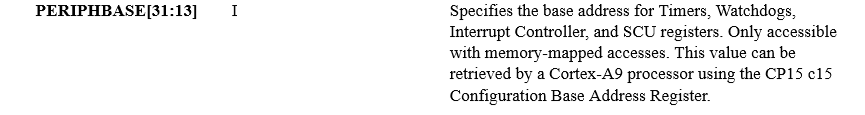
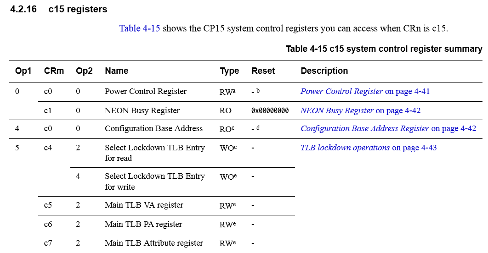

# Interrupts

There's no reasonable way of handling systems programming, such as embedded development or operating system development, without interrupts being a major consideration.

What's an interrupt, anyway? It's a kind of notification signal that a CPU receives as an indication that something important needs to be handled. An interrupt is often sent by another hardware device, in which case that's a *hardware interrupt*. The CPU responds to an interrupt by interrupting its current activity (hence the name), and switching to a special function called an *interrupt handler* or an *interrupt service routine* - ISR for short. After dealing with the interrupt, the CPU will resume whatever it was doing previously.

There are also *software interrupts*, which can be triggered by the CPU itself upon detecting an error, or may be possible for the programmer to trigger with code.

Interrupts are used primarily for performance reasons. A polling-based approach, where external devices are continuously asked for some kind of status, are inefficient. The UART driver we wrote in the previous chapter is a prime example of that. We use it to let the user send data to our program by typing, and typing is far slower than the frequency at which the CPU can check for new data. Interrupts solve this problem by instead letting the device notify the CPU of an event, such as the UART receiving a new data byte.

If you read the manual for the PL011 UART in the previous chapter, you probably remember seeing some registers that control interrupt settings, which we ignored at the time. So, changing the driver to work with interrupts should be just a matter of setting some registers to enable interrupts and writing an ISR to handle them, right?

No, not even close. Inerrupt handling is often quite complicated, and there's work to be done before any interrupts can be used at all, and then there are additional considerations for any ISRs. Let's get to it.

## Interrupt handling in ARMv7-A

Interrupt handling is very hardware-dependent. We need to look into the general interrupt handling procedure of the particular architecture, and then into specifics of a particular implementation like a specific CPU. The ARMv7-A manual provides quite a lot of useful information about interrupt handling on that architecture.

ARMv7-A uses the generic term *exception* to refer, in general terms, to interrupts and some other exception types like CPU errors. An interrupt is called an *IRQ exception* in ARMv7-A, so that's the term the manual names a lot.When an ARMv7-A CPU takes an exception, it transfers control to an instruction located at the appropriate location in the vector table, depending on the exception type. The very first code we wrote for startup began with the vector table.

As a reminder:

```
_Reset:
    b Reset_Handler
    b . /* 0x4  Undefined Instruction */
    b . /* 0x8  Software Interrupt */
    b . /* 0xC  Prefetch Abort */
    b . /* 0x10 Data Abort */
    b . /* 0x14 Reserved */
    b . /* 0x18 IRQ */
```

In the code above, we had an instruction at offset `0x0`, for the reset exception, and dead loops for the other exception types, including IRQs at `0x18`. So normally, an ARMv7-A CPU will execute the instruction at `0x18` starting from the vector table's beginning when it takes an IRQ exception.

There's more that happens, too. When an IRQ exception is taken, the CPU will switch its mode to the IRQ mode, affecting how some registers are seen by the CPU. When we were initially preparing the stack for the C environment, we set several stacks up for different CPU modes, IRQ mode being one of them.

At this point it's worth noting that IRQ (and FIQ) exceptions can be disabled or enabled globally. The `CPSR` register, which you might recall we used to explicitly switch to different modes in Chapter 4, also holds the `I` and `F` bits that control whether IRQs and FIQs are enabled respectively.

Ignoring some advanced ARMv7 features like monitor and hypervisor modes, the sequence upon taking an IRQ exception is the following:

1. Figure out the address of the next instruction to be executed after handling the interrupt, and write it into the `LR` register.

2. Save the `CPSR` register, which contains the current processor status, into the `SPSR` register.

3. Switch to IRQ mode, by changing the mode bits in `CPSR` to `0x12`.

4. Make some additional changes in `CPSR`, such as clearing conditional execution flags.

5. Check the `VE` (Interrupt Vectors Enabled) bit in the `SCTLR` (system control register). If `VE` is `0`, go to the start of the vector table plus `0x18`. If `VE` is `1`, go to the appropriate implementation-defined location for the interrupt vector.

That last part sounds confusing. What's with that implementation-defined location?

Remember that ARMv7-A is not a CPU. It's a CPU architecture. In this architecture, interrupts are supported as just discussed, and there's always the possibility to use an interrupt handler at `0x18` bytes into the vector table. That is, however, not always convenient. Consider that there can be many different interrupt sources, while the vector table can only contain one branch instruction at `0x18`. This means that the the function taking care of interrupts would first have to figure out which interrupt was triggered, and then act appropriately. Such an approach puts extra burden on the CPU as it has to check all possible interrupt sources.

The solution to that is known as vectored interrupts. In a vectored interrupt system, each interrupt has its own vector (a unique ID). Then some kind of vectored interrupt controller is in place that knows which ISR to route each interrupt vector to.

The ARMv7-A architecture has numerous implementations, as in specific CPUs. The architecture description says that vectored interrupts may be supported, but the details are left up to the implementation. The choice of which interrupt system to use, though, is controlled by the architecture-defined `SCTLR` register. In our case, implementation-defined will mean that vectored interrupts are not supported - the CPU we're using doesn't allow vectored interrupts.

## Generic Interrupt Controller of the Cortex-A9

We're programming for a CoreTile Express A9x4 daughterboard, which contains the Cortex-A9 MPCore CPU. The MPCore means it's a CPU that can consist of one to four individual Cortex-A9 cores. So it's the [Cortex-A9 MPCore manual](https://static.docs.arm.com/ddi0407/h/DDI0407H_cortex_a9_mpcore_r4p0_trm.pdf) that becomes our next stop. There's a chapter in the manual for the interrupt controller - so far so good - but it immediately refers to another manual. Turns out that the Cortex-A9 has an interrupt controller of the *ARM Generic Interrupt Controller* type, for which there's a separate manual (note that GIC version 4.0 makes a lot of references to the ARMv8 architecture). The Cortex-A9 manual refers to version 1.0 of the GIC specification, but reading version 2.0 is also fine, there aren't too many differences and none in the basic features.

The GIC is one of the major interrupt controller implementations. This is one of the area where the difference between A-profile and R-profile of ARMv7 matters. ARMv7-R CPUs such as the Cortex-R4 normally use a vectored controller like the appropriately named VIC.

The GIC has its own set of SFRs that control its operation, and the GIC as a whole is responsible for forwarding interrupt requests to the correct A9 core in the A9-MPCore. There are two main components in the GIC - the Distributor and the CPU interfaces. The Distributor receives interrupt requests, prioritizes them, and forwards them to the CPU interfaces, each of which corresponds to an A9 core.

Let's clarify with a schematic drawing. The Distributor and the CPU interfaces are all part of the GIC, with each CPU then using its own assigned CPU interface to communicate with the GIC. The communication is two-way because CPUs need to not only receive interrupts but also, at least, to inform the GIC when interrupt handling completes.

```
                     ARM GIC
  IRQ source  +------------------------+
+-------------> +----------+           |
              | |          | +-------+ |   +-----------+
  IRQ source  | | Distrib- | | CPU   +-----> Cortex A-9|
+-------------> | utor     | | I-face| |   |           |
              | |          | | 0     | |   | CPU 0     |
  IRQ source  | |          | |       <-----+           |
+-------------> |          | +-------+ |   +-----------+
              | |          |           |
  IRQ source  | |          | +-------+ |
+-------------> |          | | CPU   | |   +-----------+
              | +----------+ | I-face+-----> Cortex A-9|
  IRQ source  |              | 1     | |   |           |
+------------->              |       <-----+ CPU 1     |
              |              +-------+ |   |           |
              +------------------------+   +-----------+
```

To enable interrupts, we'll need to program the GIC Distributor, telling it to enable certain interrupts, and forward them to our CPU. Once we have some form of working interrupt handling, we'll need to tell our program to report back to the GIC, using the CPU Interface part, when the handling of an interrupt has been finished.

The general sequence for an interrupt is as follows:

1. The GIC receives an interrupt request. That particular interrupt is now considered *pending*.

2. If the specific interrupt is enabled in the GIC, the Distributor determines the core or cores to forward it to.

3. Among all pending interrupts, the Distributor chooses the one with the highest priority for each CPU interface.

4. The GIC's CPU interface forwards the interrupt to the processor, if priority rules tell it to do so.

5. The processor acknowledges the interrupt, informing the GIC. The interrupt is now *active* or, possibly, *active and pending* if the interrupt has been requested again.

6. The software running on the processor handles the interrupt and then informs the GIC that the handling is complete. The interrupt is now *inactive*.

Note that interrupts can also be preempted, that is, a higher-priority interrupt can be forwarded to a CPU while it's already processing an active lower-priority interrupt.

Just as with the UART driver previously, it's wise to identify some key registers of the GIC that we will need to program to process interrupts. I'll once again omit the `GIC` prefix in register names for brevity. Registers whose names start with `D` (or `GICD` in full) belong to the Distributor system, those with `C` names belong to the CPU interface system.

For the Distributor, key registers include:

* DCTLR - the global Distributor Control Register, containing the enable bit - no interrupts will be forwarded to CPUs without turning that bit on.

* DISENABLERn - interrupt set-enable registers. There are multiple such registers, hence the n at the end. Writing to these registers enables specific interrupts.

* DICENABLERn - interrupt clear-enable registers. Like the above, but writing to these registers disables interrupts.

* DIPRIORITYRn - interrupt priorty registers. Lets each interrupt have a different priority level, with these priorities determining which interrupt actually gets forwarded to a CPU when there are multiple pending interrupts.

* DITARGETSRn - interrupt processor target registers. These determine which CPU will get notified for each interrupt.

* DICFGRn - interrupt configuration registers. They identify whether each interrupt is edge-triggered or level-sensitive. Edge-triggered interrupts can be deasserted (marked as no longer pending) by the peripheral that triggered them in the first place, level-sensitive interrupts can only be cleared by the CPU.

There are more Distributor registers but the ones above would let us get some interrupt handling in place. That's just the Distributor part of the GIC though, there's also the CPU interface part, with key registers including:

* CCTLR - CPU interface control register, enabling or disabling interrupt forwarding to the particular CPU connected to that interface.

* CCPMR - interrupt priority mask register. Acts as a filter of sorts between the Distributor and the CPUs - this register defines the minimum priority level for an intrrupt to be forwarded to the CPU.

* CIAR - interrupt acknowledge register. The CPU receiving the interrupt is expected to read from this register in order to obtain the interrupt ID, and thereby acknowledge the interrupt.

* CEOIR - end of interrupt register. The CPU is expected to write to this register after completing the handling of an interrupt.

## First GIC implementation

Let us say that the first goal is to successfully react to an interrupt. For that, we will need a basic GIC driver and an interrupt handler, as well as some specific interrupt to enable and react to. The UART can act as an interrupt source, as a UART data reception (keypress in the terminal) triggers an interrupt. From there, we'll be able to iterate and improve the implementation with better interrupt hanlders and the use of vectorized interrupts.

This section has quite a lot of information and again refers to multiple manuals, so do not worry if it initially seems complicated!

We begin by defining the appropriate structures in a header file that could be called `gic.h`, taking the register map from the GIC manual as the source of information. The result looks something like this:

```
typedef volatile struct __attribute__((packed)) {
    uint32_t DCTLR;                 /* 0x0 Distributor Control register */
    const uint32_t DTYPER;          /* 0x4 Controller type register */
    const uint32_t DIIDR;           /* 0x8 Implementer identification register */
    uint32_t _reserved0[29];        /* 0xC - 0x80; reserved and implementation-defined */
    uint32_t DIGROUPR[32];          /* 0x80 - 0xFC Interrupt group registers */
    uint32_t DISENABLER[32];        /* 0x100 - 0x17C Interrupt set-enable registers */
    uint32_t DICENABLER[32];        /* 0x180 - 0x1FC Interrupt clear-enable registers */
    uint32_t DISPENDR[32];          /* 0x200 - 0x27C Interrupt set-pending registers */
    uint32_t DICPENDR[32];          /* 0x280 - 0x2FC Interrupt clear-pending registers */
    uint32_t DICDABR[32];           /* 0x300 - 0x3FC Active Bit Registers (GIC v1) */
    uint32_t _reserved1[32];        /* 0x380 - 0x3FC reserved on GIC v1 */
    uint32_t DIPRIORITY[255];       /* 0x400 - 0x7F8 Interrupt priority registers */
    uint32_t _reserved2;            /* 0x7FC reserved */
    const uint32_t DITARGETSRO[8];  /* 0x800 - 0x81C Interrupt CPU targets, RO */
    uint32_t DITARGETSR[246];       /* 0x820 - 0xBF8 Interrupt CPU targets */
    uint32_t _reserved3;            /* 0xBFC reserved */
    uint32_t DICFGR[64];            /* 0xC00 - 0xCFC Interrupt config registers */
    /* Some PPI, SPI status registers and identification registers beyond this.
       Don't care about them */
} gic_distributor_registers;

typedef volatile struct __attribute__((packed)) {
    uint32_t CCTLR;                 /* 0x0 CPU Interface control register */
    uint32_t CCPMR;                 /* 0x4 Interrupt priority mask register */
    uint32_t CBPR;                  /* 0x8 Binary point register */
    const uint32_t CIAR;            /* 0xC Interrupt acknowledge register */
    uint32_t CEOIR;                 /* 0x10 End of interrupt register */
    const uint32_t CRPR;            /* 0x14 Running priority register */
    const uint32_t CHPPIR;          /* 0x18 Higher priority pending interrupt register */
    uint32_t CABPR;                 /* 0x1C Aliased binary point register */
    const uint32_t CAIAR;           /* 0x20 Aliased interrupt acknowledge register */
    uint32_t CAEOIR;                /* 0x24 Aliased end of interrupt register */
    const uint32_t CAHPPIR;         /* 0x28 Aliased highest priority pending interrupt register */
} gic_cpu_interface_registers;
```

There is nothing particularly noteworthy about the structs, they follow the same patterns as explained in the previous chapter. Note that Distributor and CPU Interface stuctures cannot be joined together because they may not be contiguous in memory (and indeed aren't on the Cortex-A CPUs).

When that's done, we need to write `gic.c`, our implementation file. The first version can be really simple, but it will nonetheless reveal several things that we had not had to consider before. JHere's how `gic.c` begins:

```
#include "gic.h"

static gic_distributor_registers* gic_dregs;
static gic_cpu_interface_registers* gic_ifregs;

void gic_init(void) {
    gic_ifregs = (gic_cpu_interface_registers*)GIC_IFACE_BASE;
    gic_dregs = (gic_distributor_registers*)GIC_DIST_BASE;

    WRITE32(gic_ifregs->CCPMR, 0xFFFFu); /* Enable all interrupt priorities */
    WRITE32(gic_ifregs->CCTLR, CCTRL_ENABLE); /* Enable interrupt forwarding to this CPU */

    gic_distributor_registers* gic_dregs = (gic_distributor_registers*)GIC_DIST_BASE;
    WRITE32(gic_dregs->DCTLR, DCTRL_ENABLE); /* Enable the interrupt distributor */
}
```

We define static variables to hold pointers to the Distributor and the CPU Interface, and write an initialization function. Here you might already notice one difference from the UART driver earlier. The UART driver had its pointer initialized to the hardware address the hardware uses, like this:

```
static uart_registers* uart0 = (uart_registers*)0x10009000u;
```

With GIC registers, we cannot do the same because their address is implementation-dependent. Hardcoding the address for a particular board is possible (and it is what QEMU itself does) but we can implement the more correct way, setting those register addresses in `gic_init`. The Cortex-A9 MPCore manual states that the GIC is within the CPU's private memory region, specifically the CPU interface is at `0x0100` from `PERIPHBASE` and the Distributor is at `0x1000` from `PERIPHBASE`. What's this `PERIPHBASE` then? The A9 MPCore manual also states that:



It should be clear that the GIC Distributor is located at `PERIPHBASE + 0x1000` but obtaining `PERIPHBASE` seems confusing. Let's take a look at the `GIC_DIST_BASE` and `GIC_IFACE_BASE` macros that `gic_init` uses.

```
#define GIC_DIST_BASE   ((cpu_get_periphbase() + GIC_DISTRIBUTOR_OFFSET))
#define GIC_IFACE_BASE  ((cpu_get_periphbase() + GIC_IFACE_OFFSET))
```

I put the offsets themselves into a different CPU-specific header file `cpu_a9.h`, but it can of course be organized however you want. The `cpu_get_periphbase` function is implemented like this:

```
inline uint32_t cpu_get_periphbase(void) {
    uint32_t result;
    asm ("mrc p15, #4, %0, c15, c0, #0" : "=r" (result));
    return result;
}
```

Just what is going on there? It's a function with a weirdly-formatted assembly line, and the assembly itself refers to strange things like `p15`. Let's break this down.

C functions can use what is known as *inline assembly* in order to include assembly code directly. Inline assembly is generally used either for manual optimization of critical code, or to perform operations that are not exposed to ordinary code. We have the latter case. When writing inline assembly for GCC, you can use the *extended assembly syntax*, letting you read or write C variables. When you see a colon `:` in an inline assembly block, that's extended assembly syntax, which is [documented by GCC](https://gcc.gnu.org/onlinedocs/gcc/Extended-Asm.html) and in the simplest case looks like `asm("asm-code-here" : "output")`, where the `output` refers to C variables that will be modified.

The `%0` part in our extended assembly block is just a placeholder, and will be replaced by the first (and, in this case, the only) output operand, which is `"=r" (result)`. That output syntax in turn means that we want to use some register (`=r`) and that it should write to the `result` variable. The choice of the specific register is left to GCC. If we were writing in pure assembly, the instruction would be, assuming the `R0` register gets used for output

```
mrc p15, #4, r0, c15, c0, #0
```

That's still one strange-looking instruction. ARM processors (not just ARMv7 but also older architectures) support *coprocessors*, which may include additional functionality outside the core processor chip itself. Coprocessor 15, or CP15 for short, is dedicated to important control and configuration functions. Coprocessors are accessed through the special instructions `mrc` (read) and `mcr` (write). Those instructions contain additional opcodes, the meaning of which depends on the coprocessor.

The A9 MPCore manual makes a reference to the "CP15 c15 Configuration Base Address Register" when describing `PERIPHBASE`. CP15 is, as we now know, coprocessor 15, but the `c15` part refers, confusingly, to something else, namely to a specific register in CP15. The `mrc` instruction has a generic format, which is:

```
mrc coproc, op1, Rd, CRn, CRm [,op2]
```

So the coprocessor number comes first, `Rd` refers to the ARM register to read data to, while `op1` and optionally `op2` are operation codes defined by the coprocessor, and `CRn` and `CRm` are coprocessor registers. This means that, in order to do something with a coprocessor, we need to look up its own documentation. The coprocessor's features fall under the corresponding processor features, and we can find what interests us in the Cortex A9 manual. Chapter 4, *System Control* concerns CP15, and a register summary lists the various operations and registers that are available. Under c15, we find the following:



Looking through the table, we can finally find out that reading the Configuration Base Register, which contains the `PERIPHBASE` value, requires accessing CP15 with `Rn=c15`, `op1 = 4`, `CRm = c0`, and `op2 = 0`. Putting it all together gives the `mrc` instruction that we use in `cpu_get_periphbase`.

The remainder of `gic_init` is quite unremarkable. We enable forwarding of interrupts with all priorities to the current CPU, and enable the GIC Distributor so that interrupts from external sources could reach the CPU. Note the use of the `WRITE32` macro. Register access width was mentioned in the previous chapter, and unlike the PL011 UART, the GIC explicitly states that all registers permit 32-bit word access, with only a few Distributor registers allowing byte access. So we should take care to write the registers with one 32-bit write with this macro.

```
#define WRITE32(_reg, _val) (*(volatile uint32_t*)&_reg = _val)
```

The next order of business is to let specific interrupts be enabled. Initializing the GIC means we can now receive interrupts in general. As said before, upon receiving an interrupt, the GIC Distributor checks if the particular interrupt is enabled before forwarding it to the CPU interface. The Set-Enable registers, GICD_ISENABLER[n], control whether a particular interrupt is enabled. Each ISENABLER register can enable up to 32 interrupts, and having many such registers allows the hardware to have more than 32 different interrupt sources. Given an interrupt with id `N`, enabling it means setting the bit `N % 32` in register `N / 32`, where integer division is used. For example, interrupt 45 would be bit 13 (`45 % 32 = 13`) in ISENABLER[1] (`45 / 32 = 1`).

For each interrupt, you also need to select which CPU interface(s) to forward the interrupt to, done in the GICD_ITARGETSR[n] registers. The calculation for these registers is slightly different, for interrupt with id `N` the register is `N / 4`, and the target list has to be written to byte `N % 4` in that register.  The target list is just a byte where bit 0 represents CPU interface 0, bit 1 represents CPU interface 1 and so on. We don't need anything fancy here, we just want to forward any enabled interrupts to CPU Interface 0.

With that knowledge, writing the following function becomes quite simple:

```
void gic_enable_interrupt(uint8_t number) {
    /* Enable the interrupt */
    uint8_t reg = number / 32;
    uint8_t bit = number % 32;

    uint32_t reg_val = gic_dregs->DISENABLER[reg];
    reg_val |= (1u << bit);
    WRITE32(gic_dregs->DISENABLER[reg], reg_val);

    /* Forward interrupt to CPU Interface 0 */
    reg = number / 4;
    bit = (number % 4) * 8; /* Can result in bit 0, 8, 16 or 24 */
    reg_val = gic_dregs->DITARGETSR[reg];
    reg_val |= (1u << bit);
    WRITE32(gic_dregs->DITARGETSR[reg], reg_val);
}
```

Now we have `gic_init` to initialize the GIC and `gic_enable_interrupt` to enable a specific interrupt. The preparation is almost done, we just need functions to globally disable and enable interrupts. When using an interrupt controller, it's a good idea to disable interrupts on startup, and then enable them after the interrupt controller is ready.

Disabling interrupts is easy, we can do it somewhere in the assembly startup code in `startup.s`. At some point when the CPU is in supervisor mode, add the `cpsid if` instruction to disable all interrupts - the `if` part means both IRQs and FIQs. One possible place to do that would be right before the `bl main` instruction that jumps to C code.

Enabling interrupts is done similarly, with the `cpsie if` instruction. We'll want to call this from C code eventually so it's convenient to create a C function with inline assembly in some header file, like this:

```
inline void cpu_enable_interrupts(void) {
    asm ("cpsie if");
}
```

Looks like we're done! Just to make sure the new functions are getting used, call `gic_init()` and then `cpu_enable_interrupts()` from somewhere in the `main` function (after the initial UART outputs perhaps). At this point you can try building the program (remember to add `gic.c` to the source file list in `CMakeLists.txt`), but surprisingly enough, the program won't compile, and you'll get an error like

```
/tmp/ccluurNJ.s:146: Error: selected processor does not support `cpsie if' in ARM mode
```

This is our first practical encounter with the fact that ARMv7 (same goes for some other ARM architectures) has two instruction sets, ARM and Thumb (Thumb version 2 to be exact). Thumb instructions are smaller at 16 bits compared to the 32 bits of an ARM instruction, and so can be more efficient, at the cost of losing some flexibility. ARM CPUs can freely switch between the two instruction sets, but Thumb should be the primary choice. In the above error message, GCC is telling us that `cpsie if` is not available as an ARM instruction. It is indeed not, it's a Thumb instruction. We need to change the compiler options and add `-mthumb` to request generation of Thumb code. In `CMakeLists.txt`, that means editing the line that sets `CMAKE_C_FLAGS`. After adding `-mthumb` to it we can try to recompile. The interrupt-enabling instruction no longer causes any problems but another issue crops up:

```
/tmp/ccC72j7I.s:37: Error: selected processor does not support `mrc p15,#4,r2,c15,c0,#0' in Thumb mode
```

Indeed, accessing the coprocessors is only possible with ARM instructions. The `mrc` instruction does not exist in the Thumb instruction set. It's possible to control the CPU's instruction set and freely switch between the two, but fortunately, GCC can figure things out by itself if we tell it what specific CPU we're using. So far we've just been compiling for a generic ARM CPU, but we can easily specify the CPU by also adding `-mcpu=cortex-a9` to the compilation flags. So now with `-mthumb -mcpu=cortex-a9` added to the compile flags, we can finally compile and run the application just as before.

You should see that the program works just like it did at the end of the previous chapter. Indeed, we've enabled the GIC, and have interrupts enabled globally for the CPU, but we haven't enabled any specific interrupts yet, so the GIC will never forward any interrupts that may get triggered.

---

**NOTE**

With the GIC enabled, you can view its registers with a debugger or in the QEMU monitor, with some caveats. If you're using QEMU older than version 3.0, then the Distributor's control register will show the value `0` when read that way, even if the Distributor is actually enabled. And if you try to access the CPU Interface registers (starting at `0x1e000100`) with an external debugger like GDB, QEMU will crash, at least up to and including version 3.1.0

---

## Handling an interrupt

Let's now put the GIC to use and enable the UART interrupt, which should be triggered any time the UART receives data, which corresponds to us pressing a key in the terminal when running with QEMU. After receiving an interrupt, we'll need to properly handle it to continue program execution.

Enabling the UART interrupt should be easy since we already wrote the `gic_enable_interrupt` function, all we need to do now is to call it with the correct interrupt number. That means once again going back to the manuals to find the interrupt ID numbe we need to use. Interrupt numbers usually differ depending on the board, and in our case the CoreTile Express A9x4 manual can be the first stop. The section *2.6 Interrupts* explains that the integrated test chip for the Cortex-A9 MPCore on this board is directly connected to the motherboard (where the UART is located as we remember from the previous chapter), and that motherboard interrupts 0-42 map to interrupts 32-74 on the daughterboard. This means we need to check the motherboard manual and add 32 to the interrupt number we find there.

The Motherboard Express µATX manual explains in *2.6 Interrupt signals* that the motherboard has no interrupt controller, but connects interrupt signals to the daughterboard. The signal list says that `UART0INTR`, the interrupt signal for UART0, is number `5`. Since the daughterboard remaps interrupts, we'll need to enable interrupt `37` in order to receive UART interrupts in our program. The following snippet in `main` should do just fine:

```
gic_init();
gic_enable_interrupt(37);
cpu_enable_interrupts();
```

And we need an interrupt handler, which we need to point out in the vector table in `startup.s`. It should now look something like

```
_Reset:
    b Reset_Handler
    b Abort_Exception /* 0x4  Undefined Instruction */
    b . /* 0x8  Software Interrupt */
    b Abort_Exception  /* 0xC  Prefetch Abort */
    b Abort_Exception /* 0x10 Data Abort */
    b . /* 0x14 Reserved */
    b IrqHandler /* 0x18 IRQ */
    b . /* 0x1C FIQ */
```

The seventh entry in the vector table, at offset `0x18`, will now jump to `IrqHandler`. We can add it to the end of `startup.s`, and the simplest implementation that would tell us things are working fine can just store the data that the UART received in some register and hang.

```
IrqHandler:
    ldr r0, =0x10009000
    ldr r1, [r0]
    b .
```

Reading from the UART register at `0x10009000` gives the data byte that was received, and we proceed to store it in `R1` before hanging. Why hang? Continuing execution isn't as simple as just returning from the IRQ handler, you have to take care to save the program state before the IRQ, then restore it, which we're not doing. Our handler, the way it's written above, breaks the program state completely.

Let's compile and test now! Once the program has started in QEMU and written its greetings to the UART, press a key in the terminal to trigger the now-enabled UART interrupt. Then check the registers with `info registers` in QEMU monitors, and unfortunately you'll notice a problem. The IRQ handler doesn't seem to be running and the program is just hanging. Output could be something similar to:

```
(qemu) info registers
R00=00000005 R01=00000000 R02=00000008 R03=00000090
R04=00000000 R05=7ffd864c R06=60000000 R07=00000000
R08=00000400 R09=7fef5ef8 R10=00000001 R11=00000001
R12=00000000 R13=00000013 R14=7ff96264 R15=7ff96240
PSR=00000192 ---- A S irq32
```

Good news first, the program status register `PSR` indicates that the CPU is running in IRQ mode (`0x192 & 0x1F` is `0x12`, which is IRQ mode, but QEMU helpfully points it out by writing `irq32` on the same line). The bad news is that `R0` and `R1` don't contain the values we would expect from `IrqHandler`, and the CPU seems to be currently running code at some strange address in `R15` (remember that `R15` is just another name for `PC`, the program counter register). The address doesn't correspond to anything we've loaded into memory so the conclusion is that the CPU did receive an interrupt, but failed to run `IrqHandler`.

This is one more detail that happens due to QEMU emulation not being perfect. If you remember the discussion about memory and section layout from Chapter 4, we're pretending that our ROM starts at `0x60000000`. The Cortex-A9 CPU, however, expects the vector table to be located at address `0x0`, according to the architecture, and IRQ handling starts by executing the instruction at `0x18` from the vector table base. Unfortunately, our vector table is actually at `0x60000000` and address `0x0` is reserved by QEMU for the program flash memory, which we cannot emulate.

We then need to make a QEMU-specific modification to our code and indicate that the vector table base is at `0x60000000`. This is a very low-level modification of the CPU configuration, so you might be able to guess that the system control coprocessor, CP15, is involved again. We previously used its `c15` register to read `PERIPHBASE`, and the ARMv7-A manual will reveal that the `c12` register contains the vector table base address, which may also be modified. To write to the coprocessor, we use the `mcr` instruction (as opposed to `mrc` for reading), and the instructions we need will be:

```
ldr r0, =0x60000000
mcr p15, #0, r0, c12, c0, #0
```

Those two instructions should be somewhere early in the startup code, such as right after the `Reset_Handler` label. Having done that modification, we can perform another rebuild and test run. Press a key in the terminal, and check the registers in the QEMU monitor. Now you should see that `R0` contains the UART address, and `R1` contains the code code of the key you pressed, such as `0x66` for `f` or `0x61` for `a`.

```
R00=10009000 R01=00000066 R02=00000008 R03=00000090
```

With that, we have correctly jumped into an interrupt handler after an external interrupt triggers, which is a major step towards improving our bare-metal system.

## Surviving the IRQ handler

Our basic implementation of the IRQ handler isn't good for much, the biggest issue being that the program hangs completely and never leaves the IRQ mode.

Interrupt handlers, as the name suggests, interrupt whatever the program was doing previously. This means that state needs to be saved before the handler, and restored after. The general-purpose ARM registers, for example, are shared between modes, so if your register `R0` contains something, and then an interrupt handler writes to it, the old value is lost. This is part of the reason why a separate IRQ stack is needed (which we prepare in the startup code), as the IRQ stack is normally where the context would be saved.

When writing interrupt handlers in assembly, we have to take care of context saving and restoring, and correctly returning from the handler. Hand-written assembly interrupt handlers should be reserved for cases where fine-tuned assembly is critical, but generally it's much easier to write interrupt handlers in C, where they become regular functions for the most part. The compiler can handle context save and restore, and everything else that's needed for interrupt handling, if told that a particular function is an interrupt handler. In GCC, `__attribute__((interrupt))` is a decoration that can be used to indicate that a function is an interrupt handler.

We can write a new function in the UART driver that would respond to the interrupt.

```
void __attribute__((interrupt)) uart_isr(void) {
    uart_write("Interrupt!\n");
}
```

Then just changing `b IrqHandler` to `b uart_isr` in the vector table will ensure that the `uart_isr` function is the one called when interrupts occur. If you test this, you'll see that the program just keeps spamming `Interrupt!` endlessly after a keypress. Our ISR needs to communicate with the GIC, acknowledge the interrupt and signal the GIC when the ISR is done. In the GIC, we need a function that acknowledges an interrupt.

```
uint32_t gic_acknowledge_interrupt(void) {
    return gic_ifregs->CIAR & CIAR_ID_MASK;
}
```

`CIAR_ID_MASK` is `0x3FF` because the lowest 9 bits of `CIAR` contain the interrupt ID of the interrupt that the GIC is signaling. After a read from `CIAR`, the interrupt is said to change from pending state to active. Another function is necessary to signal the end of the interrupt, which is done by writing the interrupt ID to the `EOIR` register.

```
void gic_end_interrupt(uint16_t number) {
    WRITE32(gic_ifregs->CEOIR, (number & CEOIR_ID_MASK));
}
```

The ISR could then use those two functions and do something along the lines of:

```
void __attribute__((interrupt)) uart_isr(void) {
    uint16_t irq = gic_acknowledge_interrupt();
    if (irq == 37) {
	    uart_write("Interrupt!\n");
    }
    gic_end_interrupt(37);
}
```

This implementation is better but would still result in endless outputs. The end-of-interrupt would be correctly signaled to the GIC, but the GIC would forward a new UART interrupt to the CPU. This is because the interrupt is generated by the UART peripheral, the GIC just forwards it. The code above lets the GIC know we're done handling the interrupt, but doesn't inform the UART peripheral of that. The PL011 UART has an interrupt clear register, ICR, which is already in the header file from the last chapter. Clearing all interrupts can be done by writing `1` to bits `0-10`, meaning the mask is `0x7FF`. If we clear all interrupt sources in the UART before signaling end-of-interrupt to the GIC, everything will work.

```
void __attribute__((interrupt)) uart_isr(void) {
    uint16_t irq = gic_acknowledge_interrupt();
    if (irq == 37) {
	    uart_write("Interrupt!\n");
    }
    uart0->ICR = ICR_ALL_MASK;
    gic_end_interrupt(37);
}
```

With that interrupt handler, our program will write `Interrupt!` every time you press a key in the terminal, after which it will resume normal execution. You can verify for yourself that the CPU returns to the supervisor (SVC) mode after handling the interrupt. It can also be interesting to disassemble the ELF file and note how the code for `uart_isr` differs from any other functions - GCC will have generated `stmdb` and `ldmia` instructions to save several registers to the stack and restore them later.

## Adapting the UART driver

We now finally have working interrupt handling with a properly functional ISR that handles an interrupt, clears the interrupt source and passes control back to whatever code was running before the interrupt. Next let us apply interrupts in a useful manner, by adapting the UART driver and making the interrupts do something useful.

The first thing to note is that what we've been calling "the UART interrupt" is a specific interrupt signal, `UART0INT` that the motherboard forwards to the GIC. From the point of view of the PL011 UART itself though, several different interrupts exist. The PL011 manual has a section devoted to interrupts, which lists eleven different interrupts that the peripheral can generate, and it also generates an interrupt `UARTINTR` that is an OR of the individual interrupts (that is, `UARTINTR` is active if any of the others is). It's this `UARTINTR` that corresponds to the interrupt number 37 which we enabled, but our driver code should check which interrupt occurred specifically and react accordingly.

The `UARTMIS` register can be used to read the masked interrupt status, with the `UARTRIS` providing the raw interrupt status. The difference between those is that, if an interrupt is masked (disabled) in the UART's configuration, it can still show as active in the raw register but not the masked one. By default all interrupts all unmasked (enabled) on the PL011 so this distinction doesn't matter for us. Of the individual UART interrupts, only the receive interrupt is really interesting in the basic use case, so let's implement that one properly, as well as one of the error interrupts.

All interrupt-related PL011 registers use the same pattern, where bits 0-10 correspond to the same interrupts. The receive (RX) interrupt is bit 4, the break error (BE) interrupt is bit 9. We can express that nicely with a couple of defines:

```
#define RX_INTERRUPT	(1u << 4u)
#define BE_INTERRUPT	(1u << 9u)
```

We're using the UART as a terminal, so when the receive interrupt occurs, we'd like to print the character that was received. If the break error occurs, we can't do much except clear the error flag (in the RSRECR register) and write an error message. Let's write a new ISR that checks for the actual underlying UART interrupt and reacts accordingly.

```
void __attribute__((interrupt)) uart_isr(void) {
    (void)gic_acknowledge_interrupt();

    uint32_t status = uart0->MIS;
    if (status & RX_INTERRUPT) {
        /* Read the received character and print it back*/
        char c = uart0->DR & DR_DATA_MASK;
        uart_putchar(c);
        if (c == '\r') {
            uart_write("\n");
        }
    } else if (status & BE_INTERRUPT) {
        uart_write("Break error detected!\n");
        /* Clear the error flag */
        uart0->RSRECR = ECR_BE;
        /* Clear the interrupt */
        uart0->ICR = BE_INTERRUPT;
    }

    gic_end_interrupt(UART0_INTERRUPT);
}
```

In the previous chapter, we had a loop in `main` that polled the UART. That is no longer necessary, but remember that `main` should not terminate so the `while (1)` loop should still be there. The terminal functionality is now available and interrupt-driven!

## Handling different interrupt sources

The interrupt handling solution at this point has a major flaw. No matter what interrupt the CPU receives, the `b uart_isr` from the vector table will take us to that interrupt handler, which is of course only suitable for the UART interrupt. Early on in this chapter, there was mention of vectored interrupts, which we cannot use since our hardware uses the GIC, a non-vectored interrupt controller. Therefore we'll need to use a software solution, writing a top-level interrupt handler that will be responsible for finding out which interrupt got triggered and then calling the appropriate function.

In the simplest case, we'd then write a function like the following:

```
void __attribute__((interrupt)) irq_handler(void) {
        uint16_t irq = gic_acknowledge_interrupt();
        switch (irq) {
        case UART0_INTERRUPT:
            uart_isr();
            break;
        default:
            uart_write("Unknown interrupt!\n");
            break;
        }
        gic_end_interrupt(irq);
}
```

This top-level `irq_handler` should then be pointed to by the vector table, and adding support for new interrupts would just mean adding them to the `switch` statement. The top-level handler takes care of the GIC acknowledge/end-of-interrupt calls, so individual handlers like `uart_isr` no longer have to do it, nor do they need the `__attribute__((interrupt))` anymore because the top-level handler is where the switch to IRQ mode should happen.

Purely from an embedded code perspective, there's no problem with such a handler and having a long list of interrupts in the `switch` statement. It's not a great solution in terms of general software design though. It creates quite tight coupling between the top-level IRQ handler, which should be considered to be a separate module from the GIC, and the handler would have to know about all other relevant modules. If we place the above handler into a separate file like `irq.c`, it would have to include `uart_pl011.h` for the header's declaration of `uart_isr`. If we then add a timer module, `irq.c` would also need to include `timer.h` and `irq_handler` would have to be modified to call some timer ISR, which is not a good, maintainable way to structure the code.
