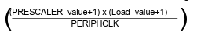

# Scheduling

**This chapter is a work in progress. If you are reading the PDF version, keep in mind the chapter isn't complete.**

Very few embedded applications can be useful without some kind of time-keeping and scheduling. Being able to program things like "do this every X seconds" or "measure the time between events A and B" is a key aspect of nearly all practically useful applications.

In this chapter, we'll look at two related concepts. *Timers*, which are a hardware feature that allows software to keep track of time, and *scheduling*, which is how you program a system to run some code, or a *task*, on some kind of time-based schedule - hence the name. Scheduling in particular is a complex subject, some discussion of which will follow later, but first we'll need to set up some kind of time measurement system.

In order to keep track of time in our system, we're going to use two tiers of "ticks". First, closer to the hardware, we'll have a timer driver for a hardware timer of the Cortex-A9 CPU. This driver will generate interrupts at regular intervals. We will use those interrupts to keep track of *system time*, a separate counter that we'll use in the rest of the system as "the time".

Such a split is not necessary in a simple tutorial system, but is good practice due to the system time thus not being directly connected to a particular hardware clock or driver implementation. This allows better portability as it becomes possible to switch the underlying timer driver without affecting uses of system time.

The first task then is to create a timer driver. Since its purpose will be to generate regular interrupts, note that this work builds directly on the previous chapter, where interrupt handling capability was added.

## Private Timer Driver

A Cortex-A9 MPCore CPU provides a global timer and private timers. There's one private timer per core. The global timer is constantly counting up, even with the CPU paused in debug mode. The per-core private timers count down from some starting value to zero, sending an interrupt when zero is reached. It's possible to use either timer for scheduling, but the typical solution is to use the private timer. It's somewhat easier to handle due to being 32 bits wide (the global timer is 64 bits) and due to stopping when the CPU is stopped.

The Cortex-A9 MPCore manual explains the private timer in Chapter 4.1. The timer's operation is quite simple. A certain starting *load value* is loaded into the load register `LR`. When the timer is started, it keeps counting down from that load value, and generates an interrupt when the counter reaches `0`. Then, if the auto-reload function is enabled, the counter automatically restarts from the load value. As is common with other devices, the private timer has its own control register `CTRL`, which controls whether auto-reload is enabled, whether interrupt generation is enabled, and whether the whole timer is enabled.

From the same manual, we can see that the private timer's registers are at offset `0x600` from `PERIPHBASE`, and we already used `PERIPHBASE` in the previous chapter for GIC registers. Finally, the manual gives the formula to calculate the timer's period.



A prescaler can essentially reduce the incoming clock frequency, but using that is optional. If we simplify with the assumption that prescaler is `0`, we can get `Load value = (period * PERIPHCLK) - 1`. The peripheral clock, `PERIPHCLK`, is the same 24 MHz clock from the motherboard that clocks the UART.

I will not go through the timer driver in every detail here, as it just applies concepts from the previous two chapters. As always, you can examine the full source in this chapter's corresponding source code folder. We call the driver `ptimer`, implement it in `ptimer.h` and `ptimer.c`, and the initialization function is as follows:

```
ptimer_error ptimer_init(uint16_t millisecs) {
    regs = (private_timer_registers*)PTIMER_BASE;
    if (!validate_config(millisecs)) {
        return PTIMER_INVALID_PERIOD;
    }
    uint32_t load_val = millisecs_to_timer_value(millisecs);
    WRITE32(regs->LR, load_val); /* Load the initial timer value */

    /* Register the interrupt */
    (void)irq_register_isr(PTIMER_INTERRUPT, ptimer_isr);

    uint32_t ctrl = CTRL_AUTORELOAD | CTRL_IRQ_ENABLE | CTRL_ENABLE;
    WRITE32(regs->CTRL, ctrl); /* Configure and start the timer */

    return PTIMER_OK;
}
```

The function accepts the desired timer tick period, in milliseconds, calculates the corresponding load value for `LR` and then enables interrupt generation, auto-reload and starts the timer.

One bit of interest here is the ISR registration, for which the interrupt number is defined as `#define PTIMER_INTERRUPT    (29u)`. The CPU manual says that the private timer generates interrupt `29` when the counter reaches zero. And in the code we're actually using `29`, unlike with the UART driver, where we mapped `UART0INTR`, number `5`, to `37` in the code. But this interrupt remapping only applies to certain interrupts that are generated on the motherboard. The private timer is part of the A9 CPU itself, so no remapping is needed.

The `millisecs_to_timer_value` function calculates the value to be written into `LR` from the desired timer frequency in milliseconds. Normally it should look like this:

```
static uint32_t millisecs_to_timer_value(uint16_t millisecs) {
    double period = millisecs * 0.001;
    return (period * refclock) - 1;
}
```

However, things are quite different for us due to using QEMU. It doesn't emulate the 24 MHz peripheral clock, and QEMU in general does not attempt to provide timings that are similar to the hardware being emulated. For our UART driver, this means that the baud rate settings don't have any real effect, but that wasn't a problem. For the timer though, it means that the period won't be the same as on real hardware, so the actual implementation used for this tutorial is:

```
static uint32_t millisecs_to_timer_value(uint16_t millisecs) {
    double period = millisecs * 0.001;
    uint32_t value = (period * refclock) - 1;
    value *= 3; /* Additional QEMU slowdown factor */

    return value;
}
```

With the timer driver in place, the simplest way to test is to make the timer ISR print something out, and initialize the timer with a one-second period. Here's the straightforward ISR:

```
void ptimer_isr(void) {
    uart_write("Ptimer!\n");
    WRITE32(regs->ISR, ISR_CLEAR); /* Clear the interrupt */
}
```

And somewhere in our `main` function:

```
gic_enable_interrupt(PTIMER_INTERRUPT);

if (ptimer_init(1000u) != PTIMER_OK) {
    uart_write("Failed to initialize CPU timer!\n");
}
```

Note the call to `gic_enable_interrupt`, and recall that each interrupt needs to be enabled in the GIC, it's not enough to just register a handler with `irq_register_isr`. This code should result in the private timer printing out a message every second or, due to the very approximate calculation in the emulated version, approximately every second.

Build everything and run (if you're implementing yourself as you read, remember to add the new C file to `CMakeLists.txt`), and you should see regular outputs from the timer.

---

**HINT**

You can use `gawk`, the GNU version of `awk` to print timestamps to the terminal. Instead of just `make run`, type `make run | gawk '{ print strftime("[%H:%M:%S]"), $0 }'` and you'll see the local time before every line of output. This is useful to ascertain that the private timer, when set to `1000` milliseconds, procudes output roughly every second.

---

## System Time

As discussed previously, we want to use some kind of *system time* system-wide. This is going to have a very straightforward implementation. The private timer will tick every millisecond, and its ISR will increment the system time. So system time itself will also be measured in milliseconds. Then `systime.c` is exceedingly simple:

```
#include "systime.h"

static volatile systime_t systime;

void systime_tick(void) {
    systime++;
}

systime_t systime_get(void) {
    return systime;
}
```

The `systime_t` type is defined in the corresponding header file, as `typedef uint32_t systime_t`.

To make use of this, the private timer's ISR is modified so it simply calls `systime_tick` after clearing the hardware interrupt flag.

```
void ptimer_isr(void) {
    WRITE32(regs->ISR, ISR_CLEAR); /* Clear the interrupt */
    systime_tick();
}
```

That's it, just change the `ptimer_init` call in `main` to use a 1-millisecond period, and you have a system-wide time that can be accessed whenever needed.

## Overflows and spaceships

A discussion of timers is an opportune time to not only make a bad pun but also to mention overflows. By no means limited to embedded programming, overflows are nonetheless more prominent in low-level systems programming. As a refresher, an overflow occurs when the result of a calculation exceeds the maximum range of its datatype. A `uint8_t` has the maximum value `255` and so `255 + 1` would cause an overflow.

Timers in particular tend to overflow. For example, our use of `uint32_t` for system time means that the maximum system timer value is `0xFF FF FF FF`, or just shy of 4.3 billion in decimal. A timer that ticks every millisecond will reach that number after 49 days. So code that assumes a timer will always keep inceasing can break in mysterious ways after 49 days. This kind of bug is notoriously difficult to track to down.

One solution is of course to use a bigger data type. Using a 64-bit integer to represent a millisecond timer would be sufficient for 292 billion years. This does little to address problems in older systems, however. Many UNIX-based systems begin counting time from the 1st of January, 1970, and use a 32-bit integer, giving rise to what's known as the Year 2038 problem, as such systems cannot represent any time after January 19, 2038.

When overflows are possible, code should account for them. Sometimes overflows can be disregarded, but saying that something "cannot happen" is dangerous. It's reasonable to assume, for example, that a microwave oven won't be running for 49 days in a row, but in some circumstances such assumptions should not be made.

One example of an expensive, irrecoverable overflow bug is the NASA spacecraft *Deep Impact*. After more than eight years in space, and multiple significant accomplishments including excavating a comet, *Deep Impact* suddenly lost contact with Earth. That was due to a 32-bit timer overflowing and causing the onboard computers to continuously reboot.

Overflow bugs can go unnoticed for many years. The binary search algorithm, which is very widely used, is often implemented incorrectly due to an overflow bug, and that bug was not noticed for two decades, in which it even made its way into the Java language's standard library.

## Scheduler types

A scheduler is responsible for allocating necessary resources to do some work. To make various bits of code run on a schedule, CPU time is the resource to be allocated, and the various tasks comprise work. Different types of schedulers and different scheduling algorithms exist, with a specific choice depending on the use case and the system's constraints.

One useful concept to understand is that of *real-time systems*. Such a system has constraints, or *deadlines*, on some timings, and these deadlines are expressed in specific time measurements. A "fast response" isn't specific, "response within 2 milliseconds" is. Further, a real-time system is said to be *hard real-time* if it cannot be allowed to miss any deadlines at all, that is, a single missed deadline constitutes a system failure. Real-time systems are commonly found in embedded systems controlling aircraft, cars, industrial or medical equipment, and so on.By contrast, most consumer-oriented software isn't real-time.

A real-time system requires a scheduler that can guarantee adherence to the required deadlines. Such systems will typically run a real-time operating system (RTOS) which provides the necessary scheduling support. We're not dealing with real-time constraints, and we're not writing an operating system, so putting RTOS aside, there are two classes of schedulers to consider.

*Cooperative schedulers* provide *cooperative (or non-preemptive) multitasking*. In this case, every task is allowed to run until it returns control to the scheduler, at which point the scheduler can start another task. Cooperative scedulers are easy to implement, but their major downside is relying on each task to make reasonable use of CPU resources. A poorly-written task can cause the entire system to slow down or even hang entirely. Implementing individual tasks is also simpler in the cooperative case - the task can assume that it will not be interrupted, and will instead run from start to finish.

Cooperative scheduling is fairly common in low-resource embedded systems, and the implementation only requires that some kind of system-wide time exists.

*Preemptive schedulers* use interrupts to *preempt*, or suspend, a task and hand control over to another task. This ensures that one task is not able to hang the entire system, or just take too long before letting other tasks run. Such schedulers implement some kind of algorithm for choosing when to interrupt a task and what task to execute next, and implementing actual preemption is another challenge.

## Cooperative scheduler

To implement a basic cooperative scheduler, we don't need much code. We need to keep track of what tasks exist in the system, how often they want to run, and then the scheduler should execute those tasks. The scheduler's header file can be written so:

```
#include "systime.h"

typedef void (*task_entry_ptr)(void);

typedef struct {
    task_entry_ptr entry;
    systime_t period;
    systime_t last_run;
} task_desc;

typedef enum {
    SCHED_OK = 0,
    SCHED_TOO_MANY_TASKS
} sched_error;

#define MAX_NUM_TASKS (10u)

sched_error sched_add_task(task_entry_ptr entry, systime_t period);
void sched_run(void);
```

Each task should have an entry point, a function that returns `void` and has no parameters. A pointer to the entry point, together with the desired task period and the time of the last run, form the task descriptor in the `task_desc` type. The scheduler provides a function `sched_add_task`, which can add tasks to the scheduler at run-time. Let's look at the implementation. Here's how `sched.c` starts:

```
#include <stddef.h>
#include <stdint.h>
#include "sched.h"

static task_desc task_table[MAX_NUM_TASKS] = {0};
static uint_8 table_idx = 0;

sched_error sched_add_task(task_entry_ptr entry, systime_t period) {
    if (table_idx >= MAX_NUM_TASKS) {
        return SCHED_TOO_MANY_TASKS;
    }

    task_desc task = {
        .entry = entry,
        .period = period,
        .last_run = 0
    };
    task_table[table_idx++] = task;

    return SCHED_OK;
}
```

The `task_table` array is where all the task descriptors are kept. `sched_add_task` is pretty simple - if there's free space in the task table, the function creates a task descriptor and adds it to the table. The task's last run time is set to `0`. Then the interesting work happens in the scheduler's `sched_run`:

```
void sched_run(void) {
    while (1) {
        for (uint8_t i = 0; i < MAX_NUM_TASKS; i++) {
            task_desc* task = &task_table[i];
            if (task->entry == NULL) {
                continue;
            }

            if (task->last_run + task->period <= systime_get()) { /* Overflow bug! */
                task->last_run = systime_get();
                task->entry();
            }
        }
    }
}
```

---

**NOTE**

The source code from the repository for this chapter includes `sched.c` with this example, but doesn't built it by default, instead it builds `sched_preemptive.c` for the preemptive scheduler that we will cover later. Change `CMakeLists.txt` if you wish to build the cooperative scheduler.

---

You may have noticed that the function is contained within an infinite `while (1)` loop. The scheduler isn't supposed to terminate, and `sched_run` will be able to replace the infinite loop that we've had in `main` all along.

The actual work is done in the scheduler's `for`-loop, which loops through the entire task table, and looks for tasks whose time to run has come, that is, the system time has increased by at least `period` since the task's last run time stored in `last_run`. When the scheduler finds such a task, it updates the last run time and executes the task by calling its entry point.

All that remains in order to test the scheduler is to add a couple of tasks, and schedule them in `main`.

```
void task0(void) {
    systime_t start = systime_get();
    uart_write("Entering task 0... systime ");
    uart_write_uint(start);
    uart_write("\n");
    while (start + 1000u > systime_get());
    uart_write("Exiting task 0...\n");
}

void task1(void) {
    systime_t start = systime_get();
    uart_write("Entering task 1... systime ");
    uart_write_uint(start);
    uart_write("\n");
    while (start + 1000u > systime_get());
    uart_write("Exiting task 1...\n");
}
```

The above defines two tasks. Note how there's nothing special about those functions, it's sufficient for them to be `void` functions with no parameters for them to be scheduled with our implementation. Both tasks have the same behavior - print a message with the current system time, wait for `1000` system time ticks and exit with another message. To actually schedule them and hand control over to the scheduler, modify `main` to get rid of the infinite loop and instead do:

```
(void)sched_add_task(&task0, 5000u);
(void)sched_add_task(&task1, 2000u);

sched_run();
```

That will schedule task 0 to run every 5000 ticks (roughly 5 seconds) and task 1 for every 2000 ticks.

---

**NOTE**

The tasks use `uart_write_uint` to print the current systime, a new function not part of the previously-written UART driver. We cannot use standard C library functions such as `sprintf` without performing additional work, so this new function is a quick way to output unsigned numbers like systime. For completeness, here's the implementation:

```
void uart_write_uint(uint32_t num) {
    char buf[8];
    int8_t i = 0;
    do {
        uint8_t remainder = num % 10;
        buf[i++] = '0' + remainder;
        num /= 10;
    } while (num != 0);
    for (i--; i >= 0; i--) {
        uart_putchar(buf[i]);
    }
}
```

---

Running the system now should produce some output indicating the scheduler's hard at work.

```
Welcome to Chapter 8, Scheduling!
Entering task 1... systime 2000
Exiting task 1...
Entering task 1... systime 4000
Exiting task 1...
Entering task 0... systime 5000
Exiting task 0...
Entering task 1... systime 6000
Exiting task 1...
Entering task 1... systime 8000
Exiting task 1...
Entering task 0... systime 10000
Exiting task 0...
Entering task 1... systime 11000
Exiting task 1...
Entering task 1... systime 13000
Exiting task 1...
Entering task 0... systime 15000
Exiting task 0...
Entering task 1... systime 16000
Exiting task 1...
```

What does that tell us? Well, the scheduler seems to be working fine. Task 0 first gets executed at systime `5000`, which is enough time for task 1 to run twice, starting at times `2000` and `4000`. We can also see that this is very much not a real-time system, as the schedule we've provided serves as a suggestion for the scheduler but isn't strictly enforced. At systime `10000`, it's time for both tasks to be executed (task 0 for the 2nd time and task 1 for the 5th time), but task 0 gets the execution slot (due to having its entry earlier in the task table), and task 1 gets delayed until systime `11000`, when task 0 finishes.

Life is good when you have a working scheduler, and indeed this kind of simple scheduler is pretty similar to what some embedded systems run in the real world. There are small improvements that can be made to the scheduler without fundamentally changing it, such as allowing each task to have a priority, so that the highest-priority task would be chosen at times when multiple tasks wish to run, such as at systime `10000` above. Note the low memory overhead of this scheduler. It uses 1 byte for the `table_idx` variable and creates a 12-byte task descriptor for each task. This kind of memory use is one of the reasons why such simple cooperative schedulers are a valid choice for resource-constrained embedded systems.

It is also easy to introduce some problems that a cooperative scheduler won't be able to manage well. For example, create a third task that just runs a `while (1);` loop. The scheduler will run the task and the system will hang with no hope of recovery. In a real system, a watchdog would probably be configured and reset everything, but a reset loop is not much better than a plain hang.

In the scheduler's `sched_run` loop, you may have noticed a comment about an overflow bug on one line. After saying how spacecraft can get lost due to overflows, it wouldn't feel right to omit an example.

```
if (task->last_run + task->period <= systime_get()) { /* Overflow bug! */
```

The normal case for that line is straightforward - if at least `period` ticks have passed since `last_run`, the task needs to be run. How about when some of these variables approach `UINT32_MAX`, the maximum value they can hold? Suppose `last_run` is almost at the maximum value, e.g. `UINT32_MAX - 10` (that's `0xFF FF FF F5`). Let's say `period` is `100`. So the task ran at `UINT32_MAX - 10` ticks, took some time to complete, and the scheduler loop runs against at, for instance, systime `UINT32_MAX - 8`. Two ticks have passed since the last execution, so the task shouldn't run. But the calculation `last_run + period` is `UINT32_MAX - 10 + 100`, which overflows! Unsigned integers wrap around to zero on overflow, and so the result becomes `89`. That is less than the current system time, and the task will run again. And the problem will repeat in the next iteration as well, until eventually fixing itself after system time also overflows and wraps around to zero.

That's a potentially serious bug that is much easier to introduce than to notice. How to perform that calculation safely, then? Instead of adding the timestamps, you should use subtraction so that the intermediate result is a duration. That check should be:

```
if (systime_get() - task->last_run >= task->period)
```

It might seem like such a calculation can go wrong. Supppose `last_run` is close to overflow, as in the example before, and systime has recently rolled over. So you'd be subtracting a very large `last_run` from the small positive result of `systime_get`, which would result in a large negative number under ordinary arithmetic. But with unsigned integers, that will still result in a correct calculation. So if the above calculation amounts to something like:

```
if (20 - (UINT32_MAX - 10) >= 100)
```

the left side will evaluate to `31`, and the `if` will evaluate to false.

Mathematically speaking, unsigned integers in C implement arithmetics modulo the type's maximum value plus one. So a `uint8_t`, holding the maximum value `255`, performs all operations modulo `256`. Importantly, only unsigned integers have overflow behavior that is guaranteed by the C standard. Signed integer overflow is undefined behavior, and you should avoid writing code that relies on signed integer overflows.

## Preemptive scheduler

Having implemented a cooperative scheduler, you should be able to appreciate its overall simplicity (the work happens in a dozen lines that only rely on an incrementing system-wide counter) as well as its fragility (each task is fully at the mercy of all other tasks). A preemptive scheduler assumes the burden of making sure that multiple tasks can run, and that the tasks (and the system as a whole) have much higher reliability than in a cooperatively-scheduled system.

Generally, a preemptive scheduler is regularly triggered by some interrupt, and then decides whether to *preempt* the currently running task and perform a *context switch*. Preempting a task here means that the task is temporarily suspended, and context switch is the mechanism by which control is handed over to another task. Different algorithms exist for preemptive schedulers depending on what kind of scheduling policy the system wants to follow, which becomes increasingly important for systems that have a higher load.

Preemptive schedulers are used in nearly all operating systems, as well as small embedded systems where cooperative scheduling isn't powerful enough.

We will implement a simple preemptive scheduler for our system, basing it on the desired periods of tasks. This will not be an optimal solution but will demonstrate the techniques on which more complex preemptive schedulers rely as well.

### Creating systick-based callbacks

There's a bit of preparatory work to be done before we can get to the part where anything is actually scheduled.

First we need some kind of way to regularly call scheduler code to possibly perform a context switch. This means we need callbacks based on systime - the global system time we used before. For this, we will extend `systime.c` with a callback table, allowing a number of different callbacks to be registered and then run at the specified points. We can use these definitions for the callback:

```
typedef uint32_t systime_t;
typedef int(*systime_callback)(void*);

typedef struct {
    systime_t time;
    systime_t period;
    systime_callback cb;
    void* arg;
} callback_entry;
```

Here `systime_callback` is a function pointer, so any function that returns `int` and takes a `void*` parameter can be used as a callback. Using `void*` as the argument type is flexible, it allows the user to potentially pass anything to the callback (the pointer could point to any user-defined struct or other data as needed). We will only use this argument to pass the task ID, but we use `void*` because it allows more to be done with callbacks. Let's create a table to hold callbacks, and a bitfield to indicate which ones are currently active.

```
static callback_entry callback_table[MAX_NUM_CALLBACKS] = {0};
static uint16_t callback_table_mask = 0u;
```

Then we add a public function that other modules can use to schedule some event (callback).

```
systime_callback_error systime_schedule_event(systime_t timestamp, systime_t period, systime_callback callback, void* arg) {
    for (uint8_t slot = 0; slot < MAX_NUM_CALLBACKS; slot++) {
        if (add_callback(timestamp, period, callback, arg, slot)) {
            return SYSTIME_CALLBACK_OK;
        }
    }
    return SYSTIME_NO_CALLBACK_SLOTS;
}
```

An event scheduled like this will trigger at systime `timestamp`, and optionally repeat after `period` ticks. The event will call `callback(arg)`. An internal function takes care of actually adding the callback to the table.

```
static int add_callback(systime_t timestamp, systime_t period, systime_callback callback, void* arg, int slot) {
    if (callback_table_mask & (1 << slot)) {
        return 0; /* Failed to add */
    }
    callback_table[slot].time = timestamp;
    callback_table[slot].period = period;
    callback_table[slot].cb = callback;
    callback_table[slot].arg = arg;

    callback_table_mask |= (1 << slot);

    return 1;
}
```

The final change we need to make in `systime.c` is to actually invoke the callbacks when needed. We can check that on every tick of system time, so `systime_tick()` gets modified accordingly:

```
void systime_tick(void) {
    systime++;
    check_callbacks();
}
```

The call to `check_callbacks()` is new, and is implemented as follows:

```
static void check_callbacks() {
    for (uint8_t slot = 0; slot < MAX_NUM_CALLBACKS; slot++) {
        if (callback_table_mask & (1 << slot)) {
            if (systime >= callback_table[slot].time) {
                /* Either reschedule or disable this callback */
                if (callback_table[slot].period != 0) {
                    callback_table[slot].time = systime + callback_table[slot].period;
                } else {
                    callback_table_mask &= ~(1 << slot);
                }

                /* Callback entry */
                callback_table[slot].cb(callback_table[slot].arg);
            }
        }
    }
}
```

It checks all currently-enabled callbacks (indicated by the `callback_table_mask` bitfield) and, if the time has come for one of the callbacks, its gets executed. Non-periodic callbacks are disabled, periodic ones will continue to trigger.

---

**NOTE**

As always, the code snippets shown here in the book come from the full code in the accompanying repository. Don't forget to check there to see the full files, and how everything fits together.

---

### Setting up the preemptive scheduler

Now that the ability to trigger the scheduler whenever needed is there, we can start with an outline of the scheduler itself. `sched_preemptive.c` will be the implementation file. We can start by copying and modifying the cooperative `sched.c`.

We will now need a proper ID for the running tasks, so we can add it to the `task_desc` struct that we used before.

```
typedef struct {
    uint8_t id;
    task_entry_ptr entry;
    systime_t period;
    systime_t last_run;
} task_desc;
```

Adding a new task in the preemptive scheduler will, for now, be just like in the cooperative one, except for also setting the task ID.

```
sched_error sched_add_task(task_entry_ptr entry, systime_t period) {
    if (table_idx >= MAX_NUM_TASKS) {
        return SCHED_TOO_MANY_TASKS;
    }

    task_desc task = {
        .id = table_idx,
        .entry = entry,
        .period = period,
        .last_run = 0,
    };
    task_table[table_idx++] = task;

    return SCHED_OK;
}
```

It will also be necessary to keep track of which task is currently running. We can do that by pointing to an entry in the task table.

```
static task_desc* current_task;
```

Now we can write a new `sched_run` function that will set up the needed callbacks and start the scheduling loop. We can begin with something like the following.

```
void sched_run(void) {
    for (uint8_t i = 0; i < MAX_NUM_TASKS; i++) {
       task_desc* task = &task_table[i];
       if (task->entry == NULL) {
            continue;
       }
       systime_t next_run = task->last_run + task->period;
       systime_schedule_event(next_run, task->period, task_switch_callback, &task->id);
    }
    current_task = &task_table[0]; // Simplification: always start the first task added
    while(1) {
    }
}
```

The `for`-loop in the beginning goes through all the tasks and sets up a callback with the right period for each. So if Task 0 wants to run every 5000 ticks (recall that we wrote `sched_add_task(&task0, 5000u);` for the cooperative scheduler), there will now be a callback every 5000 ticks. Note the last two arguments to `systime_schedule_event`, which mean that `task_switch_callback` will be the callback function, and it will be called with `&task->id` as the argument.

We also make the simplifying assumption that the first task added should begin running. In a real application, we would instead want some kind of flag in the task descriptor to specify whether a task should autostart.

Just to see if everything works so far, we can have the actual callback write out some information and update the current task pointer.

```
static int task_switch_callback(void* arg) {
    uint8_t new_task_id = *((uint8_t*)arg);
    if (new_task_id == current_task->id) {
        return 0;
    }
    uart_write("Switching context! Time ");
    uart_write_uint(systime_get());
    uart_write("; ");
    uart_write_uint(current_task->id);
    uart_write(" --> ");
    uart_write_uint(new_task_id);
    uart_write("\n");
    current_task = &(task_table[new_task_id]);

    return 0;
}
```

At this point, it should be possible to build the software and run. Note that no changes in `main()` are needed, the same calls to `sched_add_task` and `sched_run` from before are sufficient.

Running the software should give output like below:

```
Welcome to Chapter 8, Scheduling!
Switching context! Time 2000; 0 --> 1
Switching context! Time 5000; 1 --> 0
Switching context! Time 6000; 0 --> 1
Switching context! Time 10000; 1 --> 0
Switching context! Time 10000; 0 --> 1
Switching context! Time 15000; 1 --> 0
Switching context! Time 16000; 0 --> 1
Switching context! Time 20000; 1 --> 0
Switching context! Time 20000; 0 --> 1
Switching context! Time 25000; 1 --> 0
Switching context! Time 26000; 0 --> 1
Switching context! Time 30000; 1 --> 0
Switching context! Time 30000; 0 --> 1
Switching context! Time 35000; 1 --> 0
Switching context! Time 36000; 0 --> 1
Switching context! Time 40000; 1 --> 0
```

The good news here is that systime-based callbacks work. We're not running any tasks at all yet, but the `0 --> 1` and `1 --> 0` transitions indicate that the general flow seems correct. A request to change the current task comes in at the appropriate time, and the `current_task` pointer is updated accordingly.

The bad news, aside from us not actually running any tasks, is that one obvious issue with the scheduling policy is already visible. When both tasks want to run at the same time, like at systick `10000` or `20000`, we get two switch requests, wasting the one that comes first. This can be remedied by processing one callback at most for every systick. Let's add a `break` after a callback is called in `check_callbacks`:

```
/* Callback entry */
callback_table[slot].cb(callback_table[slot].arg);
break;
```

This will avoid simultaneous callbacks, but will create pretty useless 1-tick periods when a task runs, like this:

```
Switching context! Time 2000; 0 --> 1
Switching context! Time 5000; 1 --> 0
Switching context! Time 6000; 0 --> 1
Switching context! Time 10000; 1 --> 0
Switching context! Time 10001; 0 --> 1
Switching context! Time 15000; 1 --> 0
Switching context! Time 16001; 0 --> 1
```

We can tolerate the silly 1-tick periods for now, as they don't affect the next steps we're about to take.

### Getting tasks to run

Of course since we never call `entry()` on a task from the task table, we're not actually running any tasks. It's quite straightforward to add this call just after changing the `current_task` pointer in `task_switch_callback`, like this:

```
current_task = &(task_table[new_task_id]);
current_task->entry(); /* New line to actually enter the task */
```

Let's build and run this.

```
Welcome to Chapter 8, Scheduling!
Switching context! Time 2000; 0 --> 1
Entering task 1... systime 2000
```

It does run the first task we want to switch to, and promptly hangs. No more interrupts or callbacks seem to work.

What's going on here?

The answer will also be relevant later when we perform a context switch. Our problem is that we're still in the CPU's IRQ mode, and never finished dealing with the original timer interrupt that caused the systime to tick up. The best illustration is a call stack from the debugger - set a breakpoint in task1 and, when it triggets, display the call stack with the `bt` command (`bt` stands for backtrace). It will be similar to the following cleaned-up output:

```
#0  task1 () in tasks.c:15
#1  0x600006ce in task_switch_callback (arg=<optimized out>) at sched_preemptive.c:42
#2  0x600005ba in check_callbacks () at systime.c:41
#3  0x60000614 in systime_tick () at systime.c:22
#4  0x600004d4 in ptimer_isr () at ptimer.c:56
#5  0x6000042c in irq_handler () at irq.c:13
```

We've entered `task1` without ever returning from `irq_handler`. Indeed, we get a hardware interrupt from the timer peripheral, it's handled by our timer driver in `ptimer_isr`, which in turn triggered the system tick and the callback. Let's look again at the code in `irq_handler`:

```
void __attribute__((interrupt)) irq_handler(void) {
    uint16_t irq = gic_acknowledge_interrupt();
    isr_ptr isr = callback(irq);
    if (isr != NULL) {
        isr();
    }
    gic_end_interrupt(irq);
}
```

In this case, the `isr()` call is a call to `ptimer_isr()`, and since we haven't returned from there, we never call `gic_end_interrupt` to tell the GIC that we're done processing this interrupt. No more interrupts (at the same priority) will arrive. This doesn't just break scheduling, it also breaks `task1` itself if it expects some interrupts.

We need to finish interrupt processing and leave IRQ mode before we enter the task. Let's remove the `entry()` call from the callback, and let the scheduler's main loop enter the task. Change the empty `while (1)` loop in `sched_run` to instead be:

```
while(1) {
    if (current_task) {
        current_task->entry();
        current_task = NULL;
    }
}
```

Now, the callback function is responsible for updating the `current_task` pointer, but the task is actually entered from `sched_run`. If the task completes before another task wants to run, our system should just idle - so we reset the `current_task` pointer to `NULL`. We can now adjust the callback function a little bit to account for this idling possibility (see comments below), and then build and run again.

```
static int task_switch_callback(void* arg) {
    uint8_t new_task_id = *((uint8_t*)arg);
    /* Next line changed to check for idle pointer */
    if (current_task && (new_task_id == current_task->id)) {
        return 0;
    }
    uart_write("Switching context! Time ");
    uart_write_uint(systime_get());
    uart_write("; ");
    /* Check if we're idle */
    if (current_task) {
        uart_write_uint(current_task->id);
    } else {
        uart_write("(idle)");
    }
    uart_write(" --> ");
    uart_write_uint(new_task_id);
    uart_write("\n");
    current_task = &(task_table[new_task_id]);

    return 0;
}
```

The output will be much better now, such as:

```
Welcome to Chapter 8, Scheduling!
Entering task 0... systime 0
Exiting task 0...
Switching context! Time 2000; (idle) --> 1
Entering task 1... systime 2000
Exiting task 1...
Switching context! Time 4000; (idle) --> 1
Entering task 1... systime 4000
Switching context! Time 5000; 1 --> 0
Exiting task 1...
Switching context! Time 6000; (idle) --> 1
Entering task 1... systime 6000
Exiting task 1...
Switching context! Time 8000; (idle) --> 1
Entering task 1... systime 8000
Exiting task 1...
Switching context! Time 10000; (idle) --> 0
Entering task 0... systime 10000
Switching context! Time 10001; 0 --> 1
Exiting task 0...
Switching context! Time 12001; (idle) --> 1
Entering task 1... systime 12001
Exiting task 1...
Switching context! Time 14001; (idle) --> 1
Entering task 1... systime 14001
Switching context! Time 15000; 1 --> 0
Exiting task 1...
Switching context! Time 16001; (idle) --> 1
Entering task 1... systime 16001
Exiting task 1...
Switching context! Time 18001; (idle) --> 1
Entering task 1... systime 18001
Exiting task 1...
Switching context! Time 20000; (idle) --> 0
Entering task 0... systime 20000
Switching context! Time 20001; 0 --> 1
Exiting task 0...
```

Here it's useful to recall that both tasks are programmed to remain active for 1000 ticks with this loop:

```
while (start + 1000u > systime_get());
```

The first few seconds of the output even look correct. Task 0 starts right away and completes, then at systime 2000 the system is in an idle state before starting task 1. It again completes, and task 1 starts again at systime 4000. That's where things start going wrong. At systime 5000, we want to run task 0, but that doesn't happen. Next time we try to run task 0, at systime 10000, it starts, and subsequently blocks task 1 from running at systime 10001.

This is not at all surprising - we're still missing the key component of a preemptive scheduler, that is, the actual preemption and context switch.

### Moving tasks to user mode

Everything we have done so far runs in Supervisor mode, except for interrupt handlers which run in IRQ mode. Before we can peform context switching, we have to move the tasks to user mode. The bulk of the context switch action will require accessing registers of another mode. It would be possible to handle the entire switch from Supervisor mode, but it would be inelegant and also quite different from real-world application, so let's do things the right way instead.

The first step is to go back to our startup code in `startup.s` and the linker script in `linkscript.ld` to also set up a stack for user mode. Our user mode stack should be set up last - we cannot easily go back to supervisor mode once that's done! So in `startup.s`, before we enter C code with `bl main`, we will insert the following:

```
    /* User mode stack */
    msr cpsr_c, MODE_USR
    ldr r1, =_usr_stack_start
    ldr sp, =_usr_stack_end

usr_loop:
    cmp r1, sp
    strlt r0, [r1], #4
    blt usr_loop
```

The stack boundaries should be defined in `linkscript.ld` similarly to other stacks.

This seemingly small change does, in fact, change a lot. When we enter C code in `main`, the CPU will now be in user mode. It will therefore not be allowed to perform some of the critical operations we need early on, such as setting up the interrupt handling. We need to go back to supervisor mode for that. One could assume that it's a matter of just doing `msr cpsr_c, #0x13` again, but user mode code isn't allowed to change CPU status directly like that.

Switching to supervisor mode in ARMv7 is done using the `svc` instruction. The instruction also specifies a function number that identifies the supervisor function that should run. In a way, this is similar to how interrupts work - IRQ mode is entered, there's a top-level IRQ handler which then calls a specific ISR. To do something useful in supervisor mode, a top-level supervisor handler should call the appropriate handler for a specific function, so that e.g. `svc 5` and `svc 1` would do different things.

Just like when enabling interrupts, we have to modify the vector table in `startup.s`. The `svc` instruction is a software interrupt (`swi` is the old name for this instruction), and it will jump to offset `0x8` in the vector table. So we place the instruction `b SVC_Handler_Top` at that offset.

```
_Reset:
    b Reset_Handler
    b Abort_Exception /* 0x4  Undefined Instruction */
    b SVC_Handler_Top /* 0x8  Software Interrupt */
    b Abort_Exception  /* 0xC  Prefetch Abort */
    b Abort_Exception /* 0x10 Data Abort */
    b . /* 0x14 Reserved */
    b irq_handler /* 0x18 IRQ */
    b . /* 0x1C FIQ */
```

The top-level SVC handler needs to be written in assembly, and it will also prepare us for writing the context switch code - there will be some similarities.

```
SVC_Handler_Top:
    push {r0-r12, lr}
    mov r1, sp
    mrs r0, spsr
    push {r0}

    tst r0, #0x20 // Thumb mode?
    ldrneh r0, [lr, #-2]
    bicne r0, r0, #0xFF00
    ldreq r0, [lr, #-4]
    bicne r0, r0, #0xFF000000

    bl syscall_handler

    pop {r0}
    msr spsr_cxsf, r0
    ldmfd sp!, {r0-r12, pc}^
```

As usual for assembly, the code looks rather scary at first. To summarize it, the first block will save the previous CPU state, the next block will identify the specific supervisor function that was called, then the C handler will be called, and the final block will restore the previous state.

Let's go through it line by line.

```
push {r0-r12, lr}
```

This saves the previous values of registers to the stack. We have to do this in the beginning - we just received a supervisor call, probably from user mode, and need to save whatever was in the registers - when we're done processing the supervisor call, we want to go back exactly to where we were. We're saving all the general purpose registers, `R0` to `R12`, and the the link register LR. We're *not* saving the stack pointer and program counter (SP and PC) because supervisor mode has its own versions of those registers - there's no need to restore SP, and we'll overwrite PC later anyway. The value in LR that we save here points to the address to which we should return after handling the supervisor call.

```
mov r1, sp
```

After the previous `push`, SP now points to where we saved those registers. We store that address in R1 so we can have the option of accessing those values from C later. This has to be done now, before the next instructions modify SP again.

```
mrs r0, spsr
```

We also need to save the program status register. It's normally called CPSR as you may remember, but right now CPSR is already different, saying we're in supervisor mode. When the CPU responds to an exception, such as the `svc` instruction, it automatically saves the CPSR value into SPSR (the first S stands for *saved*). So when we read SPSR, it has the same value that CPSR had just before the switch to supervisor mode. With the above instruction, we copy it to `R0`. Since SPSR isn't a regular register, we have to use the `mrs` instruction for reading it, just as we had to use `msr` in chapter 4 for writing to it. This instruction, then, reads SPSR and writes the value to `R0`.

```
push {r0}
```

Here we save `R0`, which now contains the value of SPSR, to the stack. The entire state that we will need to restore is now saved on the stack.

After this block of code, the supervisor mode stack looks like this:

```
+-------------+   SP
|    SPSR     | <-----+
|             |
+-------------+   R1
|    old R0   | <-----+
|             |
+-------------+
|    old R1   |
|             |
+-------------+
|    old R2   |
|             |
+-------------+
|    .....    |
|             |
+-------------+
|    old LR   |
|             |
+-------------+
```

`SPSR` is on the top of the stack, followed by the old (before the `svc` instruction) values of `R0` to `R12` and finally the old `LR`. `R1` points to the location of the old `R0`.

Next the code goes on to extract the ID of the requested supervisor function, e.g. `6` in `svc 6`. The function ID is encoded in the `svc` instruction itself, but the encoding is different depending on whether the CPU is in ARM or Thumb mode. Since we can arrive at our handler from either mode, we need to check for both possibilities.

```
tst r0, #0x20 // Thumb mode?
```

This instruction determines the CPU's instruction mode. `R0` still holds the `SPSR` value, which, among other things, indicates the processor's instruction state. The ARMv7-A architecture manual specifies the layout of the `CPSR` and `SPSR` registers:


Bit number 5, also denoted as the `T` bit is `1` in Thumb mode and `0` in ARM mode. The `TST` instruction performs a bitwise AND on the specified register and operand. `0x20` is the bit mask for bit 5, so we're testing if bit 5 is set. Just like many other comparison instructions in assembly, `TST` updates result flags (also located in `CPSR`) instead of writing the result to some register. It could feel a bit counter-intuitive but the `TST` instruction will set the `Z` flag to `1` if bit 5 was *not* set. If the CPU is in Thumb mode, `R0 AND 0x20` will equal `0x20`, which is non-zero, so the `Z` flag will be set to `0`.

```
ldrneh r0, [lr, #-2]
```

This instruction is another example of conditional execution like what we used in startup code. `LDRNEH` is the `LDR` load instruction with the `NE` condition code. `NE` means 'not equal', so the instruction will be executed if the previous comparison (the `TST`) was non-zero (more accurately, if the `Z` flag is `0`). The instruction, then, will be executed if we're in Thumb mode.

The `[lr, #-2]` syntax is called *flexible offset syntax* in ARM assembly, and means that some offset is applied to a register. `[lr]` means the memory location that `LR` points to, `[lr, #-2]` means the memory location 2 bytes before what `LR` points to.

The purpose of this instruction is to load the previously-executed `svc` instruction into `R0`. When `svc` was executed, `LR` was set to the instruction *after* the `svc`, since `LR` is used for the return address, and we're supposed to resume from after `svc`. This means that the `svc` instruction is located one behind `LR`. In Thumb mode, each instruction is 16 bits (2 bytes) wide, so `[lr, #-2]` will point to the `svc` instruction.

Finally, there's the `H` in `LDRNEH` - it's a modifier to only load a half-word. Most instructions operate on whole words by default, which means 32 bits since ARMv7 is a 32-bit architecture. Since Thumb instructions are only 16 bits, we should perform a half-word load to load such an instruction.

```
bicne r0, r0, #0xFF00
```

Now that the `svc` instruction is in `R0`, we can extract the SVC function number. In Thumb mode, the `svc` instruction is encoded with the SVC number in the lowest 8 bits. Clearing the highest 8 bits will therefore just leave the SVC number. That is what the `BIC` (bit clear) instruction does. Here we tell the CPU to clear the highest 8 bits of a 16-bit value (mask `0xFF00`) in register `R0`, and to put the result into `R0` as well. Since this instruction still depends on being in Thumb mode, we use the `NE` condition code for `BIC` to make the execution conditional on the previous `TST`.

After this instruction, `R0` will contain the SVC number. So after `svc 6` or `svc 42`, `R0` would contain `6` or `42` respectively.

```
ldreq r0, [lr, #-4]
```

This instruction has the same purpose that `LDRNEH` did for Thumb. We load the `svc` instruction into `R0` if the CPU is in ARM mode. The condition code is now `EQ` (checks that the `Z` flag is `1`), so the instruction will execute if the previous `TST` indicated we're in ARM mode. In ARM mode, instructions are 32 bits wide, so `svc` is 4 bytes before whatever `LR` points to. Since `LDR` loads 32 bits by default, there's no need for extra modifiers. 

```
biceq r0, r0, #0xFF000000
```

Once again, same logic as with `BICNE` in Thumb mode, except that the SVC number is in the lowest 24 bits in ARM mode, so we only clear the highest 8 bits of a 32-bit value. Note that the `EQ` condition code is actually redundant - it's safe to execute this operation even in Thumb mode, as the given bit mask would leave a 16-bit value unchanged. But leaving the `EQ` there makes our intention more clear.

```
bl syscall_handler
```

After all this preparation, we can now jump to a C function to handle the SVC request (we'll write it soon).

```
pop {r0}
```

When the C handler returns, we want to restore the program state from before the `svc` instruction. This is where we use the data we had earlier pushed onto the stack. With this `POP`, we pop the most recent word from the stack into `R0`. The `SPSR` value was our latest push, so the pop places that value into `R0`.

```
msr spsr_cxsf, r0
```

With `SPSR` being a special register, we use the `MSR` instruction to write to it. Recall that `SPSR` and `CPSR` could be written partially - here the `cxsf` indicates that we want to write all parts of the register, fully restoring `SPSR` to how it was before `svc`.

```
ldmfd sp!, {r0-r12, pc}^
```

Finally, it's time to continue in the previous mode, doing whatever follows the `svc` instruction. We restore registers `R0` to `R12` from the stack, and we also put the previously-saved value of `LR` into `PC` (compare to the `push {r0-r12, lr}` instruction earlier). This terminates the SVC handler, and the CPU will continue by executing whatever instruction `PC` now points to.

That is quite a lot to take in, it might be good to test the SVC handler. The easiest way is to temporarily add some assembly before `bl main` and use `gdb` to check that things seem to be in order. We could add this test code before jumping to `main`:

```
    mov r0, #0xa0
    mov r1, #0xa1
    mov r10, #0xaa
    mov r11, #0xab
test1:
    svc 0x42
    nop
```

This time the assembly is straightforward, we just put some values into registers and do `svc 0x42`. The `test1` label is just for conveniently setting a breakpoint. You can then build and debug to see what happens (comment out `bl syscall_handler` first though since we haven't yet written the function). Running until `test1` and then checking registers with `i reg` in `gdb`, we can see the expected values in the four registers we wrote, and something like `0x60000110` in `CPSR` - the lowest 5 bits are `10000`, indicating User mode, just as expected. Then you can set a breakpoint in `SVC_Handler_Top` and step through it, observing that `0x42` ends up in `R0` at the right time, and that the registers are eventually restored. By the time we get to the `nop` after `svc 0x42`, registers should be at their previous values, and `CPSR` should again indicate that we're in User mode.


### Context switch

A preemptive scheduler has to preempt the running task when it's time to hand control to another task. If we're running Task 0 and need to switch to Task 1, then Task 0 should be forcefully suspended, its state (context) saved, and only then should Task 1 get control. When it's time to run Task 0 again, it should resume from its saved context instead of restarting from the beginning. All of that has to be done in a manner that is transparent to the tasks themselves. From a task's own perspective, everything should be the same whether it got preempted and resumed or not. 

This means we have several important questions to answer in order to implement a context switch.

* What exactly is the context of a task that we need to save?

* Where to save the context?

* How to restore a saved context?

* How to actually hand control back to a task after restoring its context?

A task's context is the values in CPU registers. These include the general-purpose registers, the all-import PC (R15) register that holds the address of the next instruction to execute, the SP register (R13) that points to the stack, and the CPSR (program status) register. The stack pointer is particularly noteworthy here because changing the SP will be what finalizes the context switch.

Let's take a look at the system-level view of ARMv7-A registers.


Our tasks run in supervisor mode (although user mode should be used there), and we want to perform context switching from IRQ mode. The link register LR holds the preferred return address from the current function or interrupt. As you can see, each mode has its own LR, so in IRQ mode we have LR_irq. It will normally point to where the CPU should continue from after the interrupt is handled. So if a timer interrupt arrived while we're somewhere in Task 0, LR_irq will point to somewhere in Task 0. This gives us a hint that we'll need to change the LR in order to give control to another task.

So we can save a task's context by saving all of its registers. We could do that by first defining a struct to
