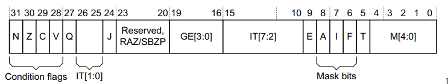
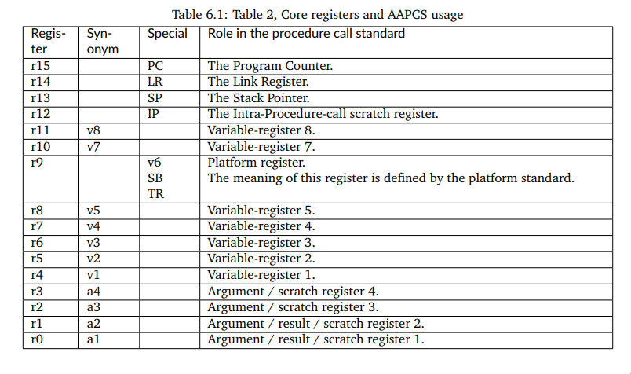
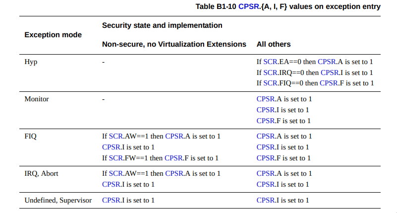

# Context switching and preemption

**This chapter is a work in progress. If you are reading the PDF version, keep in mind the chapter isn't complete.**

Having implemented a cooperative scheduler in the previous chapter, you should be able to appreciate its overall simplicity (the work happens in a dozen lines that only rely on an incrementing system-wide counter) as well as its fragility (each task is fully at the mercy of all other tasks). A preemptive scheduler assumes the burden of making sure that multiple tasks can run, and that the tasks (and the system as a whole) have much higher reliability than in a cooperatively-scheduled system.

Generally, a preemptive scheduler is regularly triggered by some interrupt, and then decides whether to *preempt* the currently running task and perform a *context switch*. Preempting a task here means that the task is temporarily suspended, and context switch is the mechanism by which control is handed over to another task. Different algorithms exist for preemptive schedulers depending on what kind of scheduling policy the system wants to follow, which becomes increasingly important for systems that have a higher load.

Context switching is one of the most central aspects of any multitasking operating system, and the implementation of a context switch is highly architecture-specific. In this chapter, we will implement context switching between tasks and between different CPU modes as well, all in order to have preemptive multitasking.

Preemptive schedulers are used in nearly all operating systems, as well as small embedded systems where cooperative scheduling isn't powerful enough. We will implement a simple preemptive scheduler for our system, basing it on the desired periods of tasks. This will not be an optimal solution but will demonstrate the techniques on which more complex preemptive schedulers rely as well.

## Creating systick-based callbacks

There's a bit of preparatory work to be done before we can get to the part where anything is actually scheduled.

First we need some kind of way to regularly call scheduler code to possibly perform a context switch. This means we need callbacks based on systime - the global system time we used before. For this, we will extend `systime.c` with a callback table, allowing a number of different callbacks to be registered and then run at the specified points. We can use these definitions for the callback:

```
typedef uint32_t systime_t;
typedef int(*systime_callback)(void*);

typedef struct {
    systime_t time;
    systime_t period;
    systime_callback cb;
    void* arg;
} callback_entry;
```

Here `systime_callback` is a function pointer, so any function that returns `int` and takes a `void*` parameter can be used as a callback. Using `void*` as the argument type is flexible, it allows the user to potentially pass anything to the callback (the pointer could point to any user-defined struct or other data as needed). We will only use this argument to pass the task ID, but we use `void*` because it allows more to be done with callbacks. Let's create a table to hold callbacks, and a bitfield to indicate which ones are currently active.

```
static callback_entry callback_table[MAX_NUM_CALLBACKS] = {0};
static uint16_t callback_table_mask = 0u;
```

Then we add a public function that other modules can use to schedule some event (callback).

```
systime_callback_error systime_schedule_event(systime_t timestamp, systime_t period, systime_callback callback, void* arg) {
    for (uint8_t slot = 0; slot < MAX_NUM_CALLBACKS; slot++) {
        if (add_callback(timestamp, period, callback, arg, slot)) {
            return SYSTIME_CALLBACK_OK;
        }
    }
    return SYSTIME_NO_CALLBACK_SLOTS;
}
```

An event scheduled like this will trigger at systime `timestamp`, and optionally repeat after `period` ticks. The event will call `callback(arg)`. An internal function takes care of actually adding the callback to the table.

```
static int add_callback(systime_t timestamp, systime_t period, systime_callback callback, void* arg, int slot) {
    if (callback_table_mask & (1 << slot)) {
        return 0; /* Failed to add */
    }
    callback_table[slot].time = timestamp;
    callback_table[slot].period = period;
    callback_table[slot].cb = callback;
    callback_table[slot].arg = arg;

    callback_table_mask |= (1 << slot);

    return 1;
}
```

The final change we need to make in `systime.c` is to actually invoke the callbacks when needed. We can check that on every tick of system time, so `systime_tick()` gets modified accordingly:

```
void systime_tick(void) {
    systime++;
    check_callbacks();
}
```

The call to `check_callbacks()` is new, and is implemented as follows:

```
static void check_callbacks() {
    for (uint8_t slot = 0; slot < MAX_NUM_CALLBACKS; slot++) {
        if (callback_table_mask & (1 << slot)) {
            if (systime >= callback_table[slot].time) {
                /* Either reschedule or disable this callback */
                if (callback_table[slot].period != 0) {
                    callback_table[slot].time = systime + callback_table[slot].period;
                } else {
                    callback_table_mask &= ~(1 << slot);
                }

                /* Callback entry */
                callback_table[slot].cb(callback_table[slot].arg);
            }
        }
    }
}
```

It checks all currently-enabled callbacks (indicated by the `callback_table_mask` bitfield) and, if the time has come for one of the callbacks, its gets executed. Non-periodic callbacks are disabled, periodic ones will continue to trigger.

---

**NOTE**

As always, the code snippets shown here in the book come from the full code in the accompanying repository. Don't forget to check there to see the full files, and how everything fits together.

---

## Preparing the preemptive scheduler

Now that the ability to trigger the scheduler whenever needed is there, we can start with an outline of the scheduler itself. The cooperative `sched.c` from the previous chapter is a good starting point for our modifications.

We will now need a proper ID for the running tasks, so we can add it to the `task_desc` struct that we used before.

```
typedef struct {
    uint8_t id;
    task_entry_ptr entry;
    systime_t period;
    systime_t last_run;
} task_desc;
```

Adding a new task in the preemptive scheduler will, for now, be just like in the cooperative one, except for also setting the task ID.

```
sched_error sched_add_task(task_entry_ptr entry, systime_t period) {
    if (table_idx >= MAX_NUM_TASKS) {
        return SCHED_TOO_MANY_TASKS;
    }

    task_desc task = {
        .id = table_idx,
        .entry = entry,
        .period = period,
        .last_run = 0,
    };
    task_table[table_idx++] = task;

    return SCHED_OK;
}
```

It will also be necessary to keep track of which task is currently running. We can do that by pointing to an entry in the task table.

```
static task_desc* current_task;
```

Now we can write a new `sched_run` function that will set up the needed callbacks and start the scheduling loop. We can begin with something like the following.

```
void sched_run(void) {
    for (uint8_t i = 0; i < MAX_NUM_TASKS; i++) {
       task_desc* task = &task_table[i];
       if (task->entry == NULL) {
            continue;
       }
       systime_t next_run = task->last_run + task->period;
       systime_schedule_event(next_run, task->period, task_switch_callback, &task->id);
    }
    current_task = &task_table[0]; // Simplification: always start the first task added
    while(1) {
    }
}
```

The `for`-loop in the beginning goes through all the tasks and sets up a callback with the right period for each. So if Task 0 wants to run every 5000 ticks (recall that we wrote `sched_add_task(&task0, 5000u);` for the cooperative scheduler), there will now be a callback every 5000 ticks. Note the last two arguments to `systime_schedule_event`, which mean that `task_switch_callback` will be the callback function, and it will be called with `&task->id` as the argument.

We also make the simplifying assumption that the first task added should begin running. In a real application, we would instead want some kind of flag in the task descriptor to specify whether a task should autostart.

Just to see if everything works so far, we can have the actual callback write out some information and update the current task pointer.

```
static int task_switch_callback(void* arg) {
    uint8_t new_task_id = *((uint8_t*)arg);
    if (new_task_id == current_task->id) {
        return 0;
    }
    uart_write("Switching context! Time ");
    uart_write_uint(systime_get());
    uart_write("; ");
    uart_write_uint(current_task->id);
    uart_write(" --> ");
    uart_write_uint(new_task_id);
    uart_write("\n");
    current_task = &(task_table[new_task_id]);

    return 0;
}
```

At this point, it should be possible to build the software and run. Note that no changes in `main()` are needed, the same calls to `sched_add_task` and `sched_run` from before are sufficient.

Running the software should give output like below:

```
Welcome to Chapter 9, Context Switch!
Switching context! Time 2000; 0 --> 1
Switching context! Time 5000; 1 --> 0
Switching context! Time 6000; 0 --> 1
Switching context! Time 10000; 1 --> 0
Switching context! Time 10000; 0 --> 1
Switching context! Time 15000; 1 --> 0
Switching context! Time 16000; 0 --> 1
Switching context! Time 20000; 1 --> 0
Switching context! Time 20000; 0 --> 1
Switching context! Time 25000; 1 --> 0
Switching context! Time 26000; 0 --> 1
Switching context! Time 30000; 1 --> 0
Switching context! Time 30000; 0 --> 1
Switching context! Time 35000; 1 --> 0
Switching context! Time 36000; 0 --> 1
Switching context! Time 40000; 1 --> 0
```

The good news here is that systime-based callbacks work. We're not running any tasks at all yet, but the `0 --> 1` and `1 --> 0` transitions indicate that the general flow seems correct. A request to change the current task comes in at the appropriate time, and the `current_task` pointer is updated accordingly.

The bad news, aside from us not actually running any tasks, is that one obvious issue with the scheduling policy is already visible. When both tasks want to run at the same time, like at systick `10000` or `20000`, we get two switch requests, wasting the one that comes first. This can be remedied by processing one callback at most for every systick. Let's add a `break` after a callback is called in `check_callbacks`:

```
/* Callback entry */
callback_table[slot].cb(callback_table[slot].arg);
break;
```

This will avoid simultaneous callbacks, but will create pretty useless 1-tick periods when a task runs, like this:

```
Switching context! Time 2000; 0 --> 1
Switching context! Time 5000; 1 --> 0
Switching context! Time 6000; 0 --> 1
Switching context! Time 10000; 1 --> 0
Switching context! Time 10001; 0 --> 1
Switching context! Time 15000; 1 --> 0
Switching context! Time 16001; 0 --> 1
```

We can tolerate the silly 1-tick periods for now, as they don't affect the next steps we're about to take.

## Getting tasks to run

Of course since we never call `entry()` on a task from the task table, we're not actually running any tasks. It's quite straightforward to add this call just after changing the `current_task` pointer in `task_switch_callback`, like this:

```
current_task = &(task_table[new_task_id]);
current_task->entry(); /* New line to actually enter the task */
```

Let's build and run this.

```
Welcome to Chapter 9, Context Switch!
Switching context! Time 2000; 0 --> 1
Entering task 1... systime 2000
```

It does run the first task we want to switch to, and promptly hangs. No more interrupts or callbacks seem to work.

What's going on here?

Our problem is that we're still in the CPU's IRQ mode, and never finished dealing with the original timer interrupt that caused the systime to tick up. The best illustration is a call stack from the debugger - set a breakpoint in task1 and, when it triggers, display the call stack with the `bt` command (`bt` stands for backtrace). It will be similar to the following cleaned-up output:

```
#0  task1 () in tasks.c:15
#1  0x600006ce in task_switch_callback (arg=<optimized out>) at sched.c:42
#2  0x600005ba in check_callbacks () at systime.c:41
#3  0x60000614 in systime_tick () at systime.c:22
#4  0x600004d4 in ptimer_isr () at ptimer.c:56
#5  0x6000042c in irq_handler () at irq.c:13
```

We've entered `task1` without ever returning from `irq_handler`. Indeed, we get a hardware interrupt from the timer peripheral, it's handled by our timer driver in `ptimer_isr`, which in turn triggered the system tick and the callback. Let's look again at the code in `irq_handler`:

```
void __attribute__((interrupt)) irq_handler(void) {
    uint16_t irq = gic_acknowledge_interrupt();
    isr_ptr isr = callback(irq);
    if (isr != NULL) {
        isr();
    }
    gic_end_interrupt(irq);
}
```

In this case, the `isr()` call is a call to `ptimer_isr()`, and since we haven't returned from there, we never call `gic_end_interrupt` to tell the GIC that we're done processing this interrupt. No more interrupts (at the same priority) will arrive. This doesn't just break scheduling, it also breaks `task1` itself if it expects some interrupts.

We need to finish interrupt processing and leave IRQ mode before we enter the task. Let's remove the `entry()` call from the callback, and let the scheduler's main loop enter the task. Change the empty `while (1)` loop in `sched_run` to instead be:

```
while(1) {
    if (current_task) {
        current_task->entry();
        current_task = NULL;
    }
}
```

Now, the callback function is responsible for updating the `current_task` pointer, but the task is actually entered from `sched_run`. If the task completes before another task wants to run, our system should just idle - so we reset the `current_task` pointer to `NULL`. We can now adjust the callback function a little bit to account for this idling possibility (see comments in the code below), and then build and run again.

```
static int task_switch_callback(void* arg) {
    uint8_t new_task_id = *((uint8_t*)arg);
    /* Next line changed to check for idle pointer */
    if (current_task && (new_task_id == current_task->id)) {
        return 0;
    }
    uart_write("Switching context! Time ");
    uart_write_uint(systime_get());
    uart_write("; ");
    /* Check if we're idle */
    if (current_task) {
        uart_write_uint(current_task->id);
    } else {
        uart_write("(idle)");
    }
    uart_write(" --> ");
    uart_write_uint(new_task_id);
    uart_write("\n");
    current_task = &(task_table[new_task_id]);

    return 0;
}
```

The output will be much better now, such as:

```
Welcome to Chapter 9, Context Switch!
Entering task 0... systime 0
Exiting task 0...
Switching context! Time 2000; (idle) --> 1
Entering task 1... systime 2000
Exiting task 1...
Switching context! Time 4000; (idle) --> 1
Entering task 1... systime 4000
Switching context! Time 5000; 1 --> 0
Exiting task 1...
Switching context! Time 6000; (idle) --> 1
Entering task 1... systime 6000
Exiting task 1...
Switching context! Time 8000; (idle) --> 1
Entering task 1... systime 8000
Exiting task 1...
Switching context! Time 10000; (idle) --> 0
Entering task 0... systime 10000
Switching context! Time 10001; 0 --> 1
Exiting task 0...
Switching context! Time 12001; (idle) --> 1
Entering task 1... systime 12001
Exiting task 1...
Switching context! Time 14001; (idle) --> 1
Entering task 1... systime 14001
Switching context! Time 15000; 1 --> 0
Exiting task 1...
Switching context! Time 16001; (idle) --> 1
Entering task 1... systime 16001
Exiting task 1...
Switching context! Time 18001; (idle) --> 1
Entering task 1... systime 18001
Exiting task 1...
Switching context! Time 20000; (idle) --> 0
Entering task 0... systime 20000
Switching context! Time 20001; 0 --> 1
Exiting task 0...
```

Here it's useful to recall that both tasks are programmed to remain active for 1000 ticks with this loop:

```
while (start + 1000u > systime_get());
```

The first few seconds of the output even look correct. Task 0 starts right away and completes, then at systime 2000 the system is in an idle state before starting task 1. It again completes, and task 1 starts again at systime 4000. That's where things start going wrong. At systime 5000, we want to run task 0, but that doesn't happen. Next time we try to run task 0, at systime 10000, it starts, and subsequently blocks task 1 from running at systime 10001.

This is not at all surprising - we're still missing the key component of a preemptive scheduler, that is, the actual preemption and context switch.

## Moving tasks out of supervisor mode

Everything we have done so far runs in Supervisor mode, except for interrupt handlers which run in IRQ mode. Before we can peform context switching, we have to move the tasks to user mode. It would be possible to handle context switching with everything running in Supervisor mode, but it would be inelegant and also quite different from real-world application, so let's do things the right way instead.

Our goal is to have the system-critical code, including the scheduler itself, running in supervisor mode, and to have the various tasks run in user mode. These modes aren't just different names for doing the same thing, they have different privilege levels. User mode code is the only *unprivileged* mode in ARMv7-A, running at what ARM calls the `PL0` privilege level. There are instructions and areas of memory that unprivileged code cannot access. For example, enabling or disabling interrupts, like what we did in Chapter 7, is only possible from privileged code. Such a concept of privilege levels is used to prevent the majority of the code that runs on a system from making the whole system unusable. This is why some program you're running on your PC cannot easily do something like disable the keyboard for the whole system.

Such separation isn't a remotely new approach. The x86 architecture has had so-called protected mode, with different privilege levels, since the Intel 80286, and became widely adopted as of Windows 3.0 running on Intel's 80386 CPUs.

The first step to start running in user mode is to go back to our startup code in `startup.s` and the linker script in `linkscript.ld` to also set up a stack for user mode, like we previously did for other modes. We define stack boundaries in `linkscript.ld` similarly to other stacks, for example to place it after the IRQ stack:

```
_usr_stack_start = _irq_stack_end;
_usr_stack_end = _usr_stack_start + 0x1000; /* 64 KB */
```

The way we set up all other stacks in `startup.s` was similar - switch to the relevant mode, set its stack pointer, write zeroes to the whole stack area. We cannot do the same for user mode however. If we enter user mode with something like `msr cpsr_c, #0x10` (`0x10` is the ID for user mode), we will not be able to go back to supervisor mode - user mode code is unprivileged and doesn't have the rights to write `CPSR`. And if we stay in user mode when we get to `main` and the rest of our C code, we will not have the necessary permissions to, among other things, initialize the GIC and enable interrupts.

In this situation, the ARMv7 System mode is very helpful. It's a mode that has the same registers available as user mode (thus including the user mode's `SP` which we need for the stack), but runs at `PL1`, that is, it's a privileged mode. System mode is never entered automatically from any exceptions, but we can enter it explicitly, set up the user mode stack, and then go back to supervisor mode by changing `CPSR`, which system mode is allowed to. So, having defined `.equ MODE_SYS, 0x1F` alongside the other modes, we can do:

```
    /* User mode stack */
    msr cpsr_c, MODE_SYS
    ldr r1, =_usr_stack_start
    ldr sp, =_usr_stack_end

usr_loop:
    cmp r1, sp
    strlt r0, [r1], #4
    blt usr_loop
    msr cpsr_c, MODE_SVC
```

With this, we'll have the user mode stack available when we need it, and we switch back to supervisor mode after setting it up so that we enter C code in supervisor mode, just like before. Now it's time to make sure the tasks run in user mode. Since they are started by the scheduler, we can modify how the scheduler calls them. Instead of just calling the task's entry point directly, we introduce an `run_task` function there so that `sched_run` does

```
run_task(current_task->entry);
```

and the first idea to write that function could be

```
static void run_task(task_entry_ptr entry) {
    asm("mov r4, 0x10"); //User mode is 0x10
    asm("msr cpsr_c, r4");
    entry();
}
```

This turns out not to be viable either. Recall that each mode has its own `LR` register, which indicates where to return to after the function completes. With the above code, we enter `run_task` from `sched_run` in supervisor mode. So `LR_svc` points into `sched_run`, then we switch into user mode and run the task's entry point in `entry()`, correctly return to `run_task` because `LR_usr` will point back there while `entry()` runs, but then we're still in user mode and cannot return to `sched_run` - we're no longer aware of it since user mode doesn't see `LR_svc`, it sees `LR_usr`. And just like in `startup.s`, we cannot directly enter supervisor mode either because user mode isn't allowed to write to `CPSR`.

For now, we can cheat a bit and use system mode again just to see that switching modes like this works. Then `run_task` would be implemented as below. The `"=r"(val)` syntax is part of GCC extended assembly, we're letting GCC pick the specific register where to store `val` instead of specifying one ourselves - although we could have used any register except `R0`, which should contain the `entry` argument, that is, the entry point function.

```
static void run_task(task_entry_ptr entry) {
    uint32_t val;
    asm("mov %0, 0x1F" : "=r"(val)); // 0x1F is system mode
    asm("msr cpsr_c, %0" : : "r"(val));
    entry();
    asm("mov %0, 0x13" : "=r"(val)); //0x13 is supervisor mode
    asm("msr cpsr_c, %0" : : "r"(val));
}
```

We're basically doing the same thing here as in startup code to switch modes, except with inline assembly in a C function. This will indeed work to make sure tasks run in a different mode until they return, while the main scheduler code continues running in supervisor mode. You can verify that by setting a breakpoint in `task0` and checking the `CPSR` register there. While a valid proof of concept, this doesn't get us to our goal of running tasks in user mode, nor does it offer much theoretical benefit. System mode is privileged just like supervisor mode, so the extra safety net of preventing tasks from certain operations just isn't there.

To get to our goal, we will need to find a way of running user mode tasks but also being able to switch back to supervisor mode code.

## Supervisor exception handler

When we were setting up interrupts, we learned that ARMv7 has several types of *CPU exceptions*, one of which is used for IRQ handling. Switching from user mode to supervisor mode can be accomplished using another exception of ARMv7, the *Supervisor Call exception*. The `SVC` assembly instruction triggers this exception, and it was called `SWI` (for Software Interrupt) in earlier versions of the ARM architecture, so if you see `SWI` in any examples, know that it's exactly the same as `SVC`. Supervisor calls with `SVC` also include some function number that identifies the desired supervisor function, so `svc 5` and `svc 1` are (or can be) calls to different functions.

This will be the method we use to return to supervisor-mode scheduler code from user-mode tasks. The idea is to switch to user mode, run the task, and then use the SVC exception to transition back into supervisor mode.

To implement software support for supervisor mode, we need to begin with a top-level handler, which means filling the appropriate entry in the vector table. The SBC handler is at offset `0x8` in the vector table, so we place a jump to the new handler there. Our vector table is now:

```
_Reset:
    b Reset_Handler
    b Abort_Exception /* 0x4  Undefined Instruction */
    b SVC_Handler_Top /* 0x8  Supervisor Call */
    b Abort_Exception  /* 0xC  Prefetch Abort */
    b Abort_Exception /* 0x10 Data Abort */
    b . /* 0x14 Reserved */
    b irq_handler /* 0x18 IRQ */
    b . /* 0x1C FIQ */
```

The top-level SVC handler needs to be written in assembly, and it will also prepare us for writing the context switch code - there will be some similarities.

```
SVC_Handler_Top:
    push {r0-r12, lr}
    mov r1, sp
    mrs r0, spsr
    push {r0}

    tst r0, #0x20 // Thumb mode?
    ldrneh r0, [lr, #-2]
    bicne r0, r0, #0xFF00
    ldreq r0, [lr, #-4]
    bicne r0, r0, #0xFF000000

    bl syscall_handler

    pop {r0}
    msr spsr_cxsf, r0
    ldmfd sp!, {r0-r12, pc}^
```

As usual for assembly, the code looks rather scary at first. To summarize it, the first block will save the previous CPU state, the next block will identify the specific supervisor function that was called, then the C handler will be called, and the final block will restore the preceding state.

Let's go through it line by line.

```
push {r0-r12, lr}
```

This saves the previous values of registers to the stack. We have to do this in the beginning - we just received a supervisor call, probably from user mode, and need to save whatever was in the registers - when we're done processing the supervisor call, we want to go back exactly to where we were. We're saving all the general purpose registers, `R0` to `R12`, and the the link register `LR`. We're *not* saving the stack pointer and program counter (SP and PC) because supervisor mode has its own version of `SP`, and we'll overwrite `PC` later. The value in `LR` that we save here points to the address to which we should return after handling the supervisor call.

```
mov r1, sp
```

After the previous `push`, SP now points to where we saved those registers. We store that address in R1 so we can have the option of accessing those values from C later. This has to be done now, before the next instructions modify SP again.

```
mrs r0, spsr
```

We also need to save the program status register. It's normally called `CPSR`, but `CPSR` has already changed and it says we're in supervisor mode. When the CPU responds to an exception, such as after executing the `svc` instruction, it automatically saves the CPSR value into SPSR (the first S stands for *saved*). So the SPSR that we see now, in supervisor mode, has the same value that CPSR had just before the switch to supervisor mode. Since SPSR isn't a regular register, we have to use the `mrs` instruction for reading it, just as we had to use `msr` in chapter 4 for writing to it. This instruction, then, reads SPSR and writes the value to `R0`.

```
push {r0}
```

Here we save `R0`, which now contains the value of SPSR, to the stack. The entire state that we will need to restore is now saved on the stack.

After this block of code, the supervisor mode stack looks like this:

```
+-------------+   R1 and SP
|    SPSR     | <-----------+
|             |
+-------------+   
|    old R0   | 
|             |
+-------------+
|    old R1   |
|             |
+-------------+
|    old R2   |
|             |
+-------------+
|    .....    |
|             |
+-------------+
|    old LR   |
|             |
+-------------+
```

`SPSR` is on the top of the stack, followed by the old (before the `svc` instruction) values of `R0` to `R12` and finally the old `LR`. `R1` points to the location of the old `R0`.

Next the code goes on to extract the ID of the requested supervisor function, e.g. `6` in `svc 6`. The function ID is encoded in the `svc` instruction itself, but the encoding is different depending on whether the CPU is in ARM or Thumb mode. Since we can arrive at our handler from either mode, we need to check for both possibilities.

```
tst r0, #0x20 // Thumb mode?
```

This instruction determines the CPU's instruction mode. `R0` still holds the `SPSR` value, which, among other things, indicates the processor's instruction state. The ARMv7-A architecture manual specifies the layout of the `CPSR` and `SPSR` registers:



Bit number 5, also denoted as the `T` bit, is `1` in Thumb mode and `0` in ARM mode. The `TST` instruction performs a bitwise AND on the specified register and operand. `0x20` is the bit mask for bit 5, so we're testing if bit 5 is set. Just like many other comparison instructions in assembly, `TST` updates result flags (also located in `CPSR`) instead of writing the result to some register. It could feel a bit counter-intuitive but the `TST` instruction will set the `Z` flag to `1` if bit 5 was *not* set. If the CPU is in Thumb mode, `R0 AND 0x20` will equal `0x20`, which is non-zero, so the `Z` flag will be set to `0`.

```
ldrneh r0, [lr, #-2]
```

This instruction is another example of conditional execution like what we used in startup code. `LDRNEH` is the `LDR` load instruction with the `NE` condition code. `NE` means 'not equal', so the instruction will be executed if the previous comparison (the `TST`) was non-zero (more accurately, if the `Z` flag is `0`). The instruction, then, will be executed if we're in Thumb mode.

The `[lr, #-2]` syntax is called *flexible offset syntax* in ARM assembly, and means that some offset is applied to a register. `[lr]` means the memory location that `LR` points to, `[lr, #-2]` means the memory location 2 bytes before what `LR` points to.

The purpose of this instruction is to load the previously-executed `svc` instruction into `R0`. When `svc` was executed, `LR` was set to the instruction *after* the `svc`, since `LR` is used for the return address, and we're supposed to resume from after `svc`. This means that the `svc` instruction is located one behind `LR`. In Thumb mode, each instruction is 16 bits (2 bytes) wide, so `[lr, #-2]` will point to the `svc` instruction.

Finally, there's the `H` in `LDRNEH` - it's a modifier to only load a half-word. Most instructions operate on whole words by default, which means 32 bits since ARMv7 is a 32-bit architecture. Since Thumb instructions are only 16 bits, we should perform a half-word load to load such an instruction.

```
bicne r0, r0, #0xFF00
```

Now that the `svc` instruction is in `R0`, we can extract the SVC function number. In Thumb mode, the `svc` instruction is encoded with the SVC number in the lowest 8 bits. Clearing the highest 8 bits will therefore just leave the SVC number. That is what the `BIC` (bit clear) instruction does. Here we tell the CPU to clear the highest 8 bits of a 16-bit value (mask `0xFF00`) in register `R0`, and to put the result into `R0` as well. Since this instruction still depends on being in Thumb mode, we use the `NE` condition code for `BIC` to make the execution conditional on the previous `TST`.

After this instruction, `R0` will contain the SVC number. So after `svc 6` or `svc 42`, `R0` would contain `6` or `42` respectively.

```
ldreq r0, [lr, #-4]
```

This instruction has the same purpose that `LDRNEH` did for Thumb. We load the `svc` instruction into `R0` if the CPU is in ARM mode. The condition code is now `EQ` (checks that the `Z` flag is `1`), so the instruction will execute if the previous `TST` indicated we're in ARM mode. In ARM mode, instructions are 32 bits wide, so `svc` is 4 bytes before whatever `LR` points to. Since `LDR` loads 32 bits by default, there's no need for extra modifiers. 

```
biceq r0, r0, #0xFF000000
```

Once again, same logic as with `BICNE` in Thumb mode, except that the SVC number is in the lowest 24 bits in ARM mode, so we only clear the highest 8 bits of a 32-bit value. Note that the `EQ` condition code is actually redundant - it's safe to execute this operation even in Thumb mode, as the given bit mask would leave a 16-bit value unchanged. But leaving the `EQ` there makes our intention more clear.

```
bl syscall_handler
```

After all this preparation, we can now jump to a C function to handle the SVC request (we'll write it soon).

```
pop {r0}
```

When the C handler returns, we want to restore the program state from before the `svc` instruction. This is where we use the data we had earlier pushed onto the stack. With this `POP`, we pop the most recent word from the stack into `R0`. The `SPSR` value was our latest push, so the pop places that value into `R0`.

```
msr spsr_cxsf, r0
```

With `SPSR` being a special register, we use the `MSR` instruction to write to it. Recall that `SPSR` and `CPSR` could be written partially - here the `cxsf` indicates that we want to write all parts of the register, fully restoring `SPSR` to how it was before `svc`. Note that it's not acceptable to write directly to `CPSR` here - doing so would immediately switch back to the previous mode (like user mode), and would therefore lose us access to the other registers that are saved on the supervisor stack.

```
ldmfd sp!, {r0-r12, pc}^
```

Finally, it's time to continue in the previous mode, doing whatever follows the `svc` instruction. To do that, we restore registers `R0` to `R12` from the stack, and we also put the previously-saved value of `LR` into `PC` (compare to the `push {r0-r12, lr}` instruction earlier). It might seem like the registers could also be restored with a `POP` instruction for popping from the stack, like `pop {r0-r12, pc}`. It would indeed restore all of those registers, but would not restore `CPSR`. To return from an exception handler (like the top-level IRQ or SVC handlers), an ARMv7-A CPU needs to perform an instruction with a special flag that indicates the exception handling is over. 

The `LDMFD` instruction is essentially equivalent to popping from the stack. `LDM` is the load-multiple instruction, and `FD` is a suffix indicating a full descending stack, that is, a stack that starts at a higher address and grows towards lower addresses. Our system uses a descending stack, as initially set up in Chapter 4. The key element in the above instruction, and the reason why we cannot use `POP`, is the `^` flag at the end - it indicates the end of exception handling code, meaning that `CPSR` will be restored from `SPSR` in the same instruction.

---

**NOTE**

Despite the similarities of `svc` calls to supervisor and interrupts (both are considered exceptions in ARMv7), we had to do some extra work here that we didn't have to for IRQs. In the IRQ case, saving the previous state and then restoring it was handled for us by the compiler. That's essentially what `__attribute__((interrupt))` does, it tells the compiler to generate code for saving the previous state and restoring it after the function. We could handle supervisor calls similarly with a GCC attribute, but writing the assembly manually is a way to better understand the compiler-generated magic, and the concepts behind context switching.

---

That is quite a lot to take in, it might be good to test the SVC handler. The easiest way is to temporarily add some assembly before `bl main` and use `gdb` to check that things seem to be in order. We could add this test code before jumping to `main`:

```
    msr cpsr_c, MODE_SYS
    mov r0, #0xa0
    mov r1, #0xa1
    mov r10, #0xaa
    mov r11, #0xab
test1:
    svc 0x42
after_svc:
    nop
    bl test2
    msr cpsr_c, MODE_SVC

.func test2
.thumb_func
test2:
    .thumb
    svc 0xbb
    nop
    bx lr
.endfunc
.arm
```

This time most of the assembly is straightforward, we just switch to system mode, put some values into registers and do `svc 0x42`. The `test1` label is only there for conveniently setting a breakpoint. You can then build and debug to see what happens (comment out `bl syscall_handler` first though since we haven't yet written the function). Running until `test1` and then checking registers with `i reg` in GDB, we can see the expected values in the four registers we wrote, and something like `0x6000011F` in `CPSR` - the lowest 5 bits are `11111` or `0x1F`, indicating System mode, just as expected. Then you can set a breakpoint in `SVC_Handler_Top` and step through it, observing that `0x42` ends up in `R0` at the right time, and that the registers are eventually restored. By the time we get to the `nop` after `svc 0x42`, registers should be at their previous values, and `CPSR` should again indicate that we're in System mode.

`test2` will request a different SVC function with `svc 0xbb`, but it will put the CPU into Thumb mode first. This lets us see that our SVC handler gets the SVC number correctly in both modes. The extra stuff around `test2` is there to be able to mix ARM and Thumb code in the same file, but those details are not very relevant to the subject at hand.

---

**NOTE**

Using `gdb` directly to debug can be a bit daunting, as first noted when setting `gdbserver` up a few chapters ago. Especially if you're used to IDEs with integrated debuggers, raw GDB may feel hard to use. Search online either for tutorials on how to use GDB efficiently, especially with its TUI (Textual User Interface), or get one of the many graphical frontends available. There's nothing inferior about a frontend, in fact the built-in debugger in many IDEs is a frontend for GDB anyway.

---

## End-of-task syscall handler

Now that our system can enter and exit supervisor mode when requested, we have to write the `syscall_handler` function that will be called from the assembly SVC handler. Its signature would be:

```
void syscall_handler(uint32_t syscall, uint32_t *regs)
```

A *calling convention* specifies an agreed-upon way of implementing function calls at the low level, and is part of the *application-binary interface* (ABI). The ARM calling convention states that function arguments are passed in registers `R0` to `R3`. A calling convention is exactly that, a convention, there is no mechanism within the CPU that enforces adherence. It's up to developers, primarily compiler and OS developers, to ensure the calling convention is respected. We can be sure that the GCC cross-compiler respects this calling convention (by the way, the `eabi` in `gcc-arm-none-eabi` stands for Embedded Application Binary Interface).

Here's the summary of how the core registers are supposed to be used, taken from the ARM calling convention:



In the assembly code, we saved the desired SVC function number in `R0`, and we also let `R1` point at the previously-saved registers on the stack. In our `syscall_handler`, `R0` and `R1` thus become arguments to the function. Now that we're back in C, we can comfortably do whatever we want to handle various SVC functions. These functions are usually referred to as *system calls*, or *syscalls* for short, and the term isn't specific to ARM or embedded development - it's a general name for calls to important privileged functions that unprivileged code requests.

It's important to note that the specific SVC function numbers have no architectural meaning. ARM doesn't define any such thing as "SVC function 5" or "syscall 2". It's entirely up to the software to assign and implement the functions necessary for that software. We can keep syscalls that we support in an `enum`. Let's define a syscall that a user mode task can call when it terminates to hand control back to the scheduler.

```
enum syscalls {
    SYSCALL_ENDTASK = 0
};
```

---

**Is this an operating system?**

With the implementation of system calls and, soon enough, context switching, one could wonder whether our system has transitioned from a simple bare-metal system to being an operating system. Indeed, managing tasks and providing various syscalls are key parts of an OS kernel. It's also typical for an OS kernel to be the part that starts first and runs in privileged mode.

The definition of an operating system is surprisingly vague. It could be argued that, after finishing this chapter, we will have a minimalistic embedded operating system. Or you could say that the system still lacks some major OS features, such as memory management, and doesn't provide enough useful abstraction to its tasks to qualify as an operating system. It's up to you how to think of this system.

---

What will our handler actually do, then, to let the scheduler resume as it should? The scheduler will need to restore the state that it had before executing the task, and that means the state has to be saved somewhere first. The scheduler's `run_task` function should first save the state, which we can accomplish with some inline assembly. Before writing the end-of-task syscall handler, we may as well deal with saving the state first - it will give us a better idea of how to restore it.

Let's consider what we need to save when we are in `run_task` and before we trigger the transition to user mode. Do we really need everything?

* General-purpose registers. `R0` contains the `entry` argument, that is, the address of the task's entry point. It's used only to enter the task, we don't need to restore it after the task completes, therefore we don't need to save it either. We don't need the other general-purpose registers either, as the ARM calling convention can tell us. `run_task` has no more arguments, and doesn't have any local variables we could lose. `run_task` was called from `sched_run`, and the state of `sched_run` was already saved on the stack when calling `run_task` - it's just a regular C function call, and then the compiler takes care of saving the caller's state. So, there's no need to save the general-purpose registers.

* The program state register `CPSR`. It may seem like we don't need to save it because the user mode task doesn't have the rights to change anything in `CPSR` that we need to keep. That's true, but `CPSR` also contains the `I` and `F` bits, which indicate whether interrupts (IRQs and FIQs respectively) are enabled. We will want to save this information so that we can restore the previous interrupt state. Now, our tutorial system always keeps interrupts on after enabling them for the first time, but we will want to keep track of interrupt state properly nonetheless. It's very common for real systems to briefly disable interrupts to run some critical code.

* The link register, `LR`. When we enter `run_task`, `LR` will point to where the CPU should continue after `run_task` returns, which is inside the loop in `sched_run`. We indeed want to continue there, so `LR` should be saved.

Simply saving `LR` and `CPSR` seems to be sufficient. Both registers can be saved on the stack. Very importantly, we need to think about `SP`. When we push `LR` and `CPSR` to the stack, supervisor mode `SP` will point to them. But after the user task terminates and executes a Supervisor Call, the CPU will first switch to the assembly SVC handler, which will modify `SP` further. We'll get into more detail on this a bit later on.

To provide a memory location to save `SP` to, we can simply allocate a static variable in the scheduler:

```
static uint32_t saved_sp;
```

Armed with the above information, we can make an attempt to rewrite the first part of `run_task`.

```
static void run_task(task_entry_ptr entry) {
    asm("mrs r1, cpsr \n\t"
        "push {r1, lr} \n\t"
        "bic r1, r1, 0x3 \n\t"
        "msr cpsr_c, r1"
        );

    entry();
}
```

First a couple of technical notes on the extended assembly syntax - when we want multiple assembly statements, they should be written in one `asm(...)` block. Using a separate `asm` block for each instruction allows GCC to treat the statements as independent, so they could be reordered for optimization, which would break the functionality. Also, when splitting a multi-statement `asm` block into multiple lines like above, including `\n` to indicate newlines is mandatory.

In one of the instructions there, we use the `%0` placeholder instead of a specific register. We've done this before, and in the case of this multi-statement block the meaning is the same. GCC will choose what register to use there, and it will respect the output operator list after the `:` sign, which in our case is `"=r"(saved_sp)`. The list means that the first placeholder in the assembly block (so `%0`, which is also the only placeholder) is a write operation on the variable `saved_sp`.

Onto the code now.

```
mrs r1, cpsr
```

We move the current `CPSR` value into `R1`. Recall that `R0` contains the `entry` argument and shouldn't be overwritten.

```
push {r1, lr}
```

We save `R1` and `LR` on the stack.

```
bic r1, r1, 0x3
```

Here we clear the lowest two bits, or mask `0x3` of `R1`, but the intention could be a bit non-obvious. What we really want is to switch to user mode. Writing `0x10` to the C section of `CPSR`, that is, `cpsr_c`, would work, but the C section includes more than the mode, it also includes the interrupt mask bits `I` and `F` (you can refer to the image with `CPSR` breakdown earlier in this chapter). If we write `0x10` to the lowest 8 bits, we'll be setting the interrupt mask bits to `0`. It would work in our particular case (as noted, those bits are `0` for sure anyway when we're at this point), but in general it's a great way to introduce a bug that's difficult to discover. Accidentally changing the interrupt bits from `1` to `0` before running a task would mean the task runs with interrupts enabled, which could manifest in all sorts of strange behavior if the task expects interrupts to be off.

`R1` holds the current `CPSR` value due to the previous `mrs`. In supervisor mode, the lowest 5 bits are `0x13`, in user mode they are `0x10`. So clearing the `0x3` mask gives us a value we can use for `CPSR` to enter user mode without changing anything else in `CPSR`.

```
msr cpsr, r1
```

We place the value we previously built into `CPSR`. This is the last instruction that will execute in supervisor mode - the call to `entry()` on the next line will be executed in user mode, ensuring that the entire task remains in user mode.

It's very good that we can switch to user mode like this, but we've only done half of the job. Thus far the situation isn't much different from when we directly wrote `0x10` to `CPSR_c` - we still don't have the code to resume the scheduler properly after the task terminates. All the building blocks are now in place though, and we can implement the rest of enf-of-task handling.

When `entry()` returns, execution will jump back to `run_task`, still in user mode. At that point we need to jump back into supervisor mode, and restore the previously-saved state. Let's continue building `run_task`.

```
/* ... previous code ... */
entry();
asm("svc 0");
asm("nop");
```

We will perform a Supervisor Call, the only way to get back to supervisor mode from user mode. Let the arbitrarily chosen function number `0` indicate end of task. The subsequent `nop` is there just to illustrate a point - what mode will the CPU be in when it's executed? You might think it's supervisor mode, but no, it will be back in user mode. When the CPU is done handling the supervisor call exception, it will return to the previous state, using the assembly code we ourselves wrote in the SVC handler. Specifically, the sequence here will be:

1. `entry()` returns, we're in user mode.

2. The `svc 0` instruction is executed in user mode. This triggers a supervisor call exception, the CPU jumps to supervisor mode and starts executing `SVC_Handler_Top`, the assembly handler we wrote.

3. The assembly handler calls `syscall_handler`. CPU is still in supervisor mode, and `syscall_handler` returns after completing.

4. Control goes back to `SVC_Handler_Top`, which finally concludes with the `ldmfd sp!, {r0-r12, pc}^` instruction. It signifies end of exception handling, and the CPU returns to its pre-exception `CPSR`, which says user mode.

5. `PC` now points at the `nop`, which executes.

We need to stay in supervisor mode after `svc 0` though. In general it's useful to have system calls that do something and then return to the previous mode, but not for the end-of-task call. We need to change the above sequence, and that's something we can do in the specific handler for our syscall.

Right after `svc 0` is executed, as part of the CPU's exception entry procedure, the address of the next instruction is entered into `LR`. So in the example above, the address of the `nop` would be in `LR` as soon as `SVC_Handler_Top` starts. If we can continue execution from `LR` and skip restoration of the pre-exception state, we'll remain in supervisor mode. Before calling `syscall_handler` from assembly, we made sure that `R1` points to the registers that assembly code saved in its first line, `push {r0-r12, lr}`. `LR` is among them. That leads to the following system call handler (we could mix C and assembly in the `asm` block, but system call handlers are often written in assembly, and in this case it's more educational to keep that part C-free).

```
void syscall_handler(uint32_t syscall, uint32_t *regs) {
    switch (syscall) {
    
    case SYSCALL_ENDTASK: ;
        asm ("mov r3, 60 \n\t"
        "add sp, r3 \n\t"
        "ldr r3, [r1, #56] \n\t" //LR is regs[14]
        "mov pc, r3");
        break;
    }
}
```

The first thing we do is to add `60` to `SP` (using `R3` to store the value `60` as an intermediate step). We do this to prepare the rest of `run_task` for retrieving its stored state. When `run_task` saved two registers on the stack, the stack looked like:

```
+-------------+   SP
|      LR     | <-------+
|             |
+-------------+
|     CPSR    |
|             |
+-------------+
```

By the time we're in `syscall_handler`, the stack pointer has changed and the situation is like this:

```
+-------------+   SP
|      ..     | <-------+
|             |
+-------------+   old SP
|      LR     | <-------+
|             |
+-------------+
|     CPSR    |
|             |
+-------------+
```

Why has the stack pointer changed? It's due to `SVC_Handler_Top` once again, which pushed registers onto the stack. More precisely, the assembly code there pushed 15 registers to the stack (`R0` to `R12` makes 13, plus `LR`, plus `SPSR`). Each register is 32 bits or 4 bytes. Now we know that, in the time between `run_task` saving registers and us executing `syscall_handler`, another `15 * 4 = 60` have been pushed to the stack. Therefore we add `60` to `SP`, skipping these recent additions to the stack and getting `SP` to where it was. If you're unsure why we're adding to `SP` and not subtracting, recall that the stack grows towards lower addresses, that is, `SP` decreases as you push. If `SP` is `x` and you then push one register such as with `push {lr}`, `SP` becomes `SP - 4`.

After restoring `SP`, we have this interesting line:

```
ldr r3, [r1, #56] //LR is regs[14]
```

The instruction will retrieve the user-mode `LR` value which was saved onto the stack in `SVC_Handler_Top` - the `LR` value that points to after `svc 0`. Before jumping to `syscall_handler`, the assembly code made sure that `R1` points to the saved registers. If we were writing C here, we could retrieve `LR` by writing `args[14]`. The `args` argument is the same as `R1`, and if we view it as an array of registers then `LR` is at offset `14` (`SPSR` is at offset `0`, `R0` is at offset `1` and so on).

Since we're writing assembly instead, we're using the immediate-offset form of the `LDR` instruction. We say that we want to load the value from address in `R1 + 56 bytes` ino `R3`. It's important to pay attention here to the fact that `LDR` loads a word (4 bytes) but the offset specified is in bytes. To load a word at offset `14` in the array, equivalent to saying `regs[14]` in C, we have to use the offset `14 * 4 = 56`. For this instruction, we can reuse `R3`, as we no longer need the previous value in it.

```
mov pc, r3
```

We put the previously-retrieved value into `PC`.

The handler for `SYSCALL_ENDTASK` (syscall `0`) thus retrieves the stored value of `LR` and then moves it into `PC`, which immediately performs a jump to that address. The last part of `SVC_Handler_Top` is therefore skipped, and execution continues from the instruction that followed `svc 0`, still in supervisor mode. Let's now continue writing the end-of-task code:

```
/* ... previous code ... */
entry();
asm("svc 0 \n\t"
"pop {r0, lr} \n\t"
"msr cpsr, r0"
: : "r"(saved_sp));
```

After the syscall, the code loads the previous state, pretty much performing the same steps as for saving it but in reverse. `SP` is restored from the `saved_sp` variable, and then the two saved registers are popped from the stack. Popping `LR` means the code will resume at the right place when this function returns, and finally the previously-saved `CPSR` value is written back into `CPSR`.

Once again, an important note on interrupts. We remain in supervisor mode after `svc 0`, so it may not seem necessary to restore `CPSR`. Indeed, it's not needed for restoring the mode, but is needed to restore the interrupt mask state, the `I` and `F` bits. In fact, when a CPU takes an exception to supervisor mode, IRQs get automatically disabled (the `I` bit gets set to `1`). A debugger would let you see how the `CPSR` value changes during the end-task code. Here's a summary from the ARMv7-A architecture manual on what happens to the interrupt mask upon exception entry:



### Worked example

The previous section is the most complicated thing we've done so far. There's context switching between the user and supervisor modes, implemented from scratch without relying on compiler attributes. On top of that, there is the mixing of assembly and C, and architecture-specific issues like keeping track of the interrupt mask bits. To better understand what's going on, let's follow an example through the major steps. For this example, we'll use some more convenient values than we would actually see when running.

Our example begins just before execution reaches `run_task` for the first time. We're in supervisor mode, about to start a task for the first time. We arrive at `run_task` from `sched_run`. Let's suppose the instructions are at these addresses:

```
run_task(current_task->entry); // At 0x1000
current_task = NULL;                // At 0x1002
```

We enter `run_task`. Let's suppose that the task's `entry` is at `0x1050`. Then the registers when we enter `run_task` will be: `R0 = 0x1050`, `LR = 0x1002`, `CPSR = 0x??????33`. The `entry` argument is in `R0`, `LR` points to the instruction after the `run_task` call, and the lowest byte of `CPSR` indicates Thumb instruction mode, interrupts enabled and supervisor mode. For the rest of the example, only the lowest bit of `CPSR` will be listed. Let's also say that `SP` at this time is `0x600` (arbitrarily chosen). Let's use the addresses below for instructions in `run_task`:

```
mrs r1, cpsr    // At 0x1010
push {r1, lr}   // At 0x1012
bic r1, r1, 0x3 // At 0x1014
msr cpsr_c, r1  // At 0x1016
entry();        // At 0x1018
svc 0           // At 0x101A
pop {r0, lr}    // At 0x101C
msr cpsr, r0    // At 0x101E
```


First `run_task` pushes `CPSR` and `LR` onto the stack. The supervisor mode stack is now:

```
+-------------+   SP = 0x5F8
|     0x33    | <-----------+
|             |
+-------------+  [0x5FC]
|    0x1002   |
|             |
+-------------+  [0x600]
|     ....    |
+-------------+
```

Note that the stack grows towards lower addresses, so after pushing eight bytes, `SP` is now `0x600 - 8 = 0x5F8`.

Then the lowest 3 bits of `CPSR` get cleared and now `CPSR = 0x30` (interrupts enabled, user mode). Next, `entry()` gets called. `LR` is immediately set to `0x101A`, the instruction after the `entry()` call.

By the time `entry()` returns, we don't know anything for sure about most of the registers. All we know is that `entry()` will return and the next instruction will be `svc 0`, at `0x101A`, and that `CPSR` still ends in `0x30`. We don't know the state of registers `R0-R12`, so let's say they're `0xA0`, `0xA1`, `0xA2` and so on until `R12 = 0xAC`.

Next comes the most interesting moment. `svc 0` is executed. `LR` is set to the following instruction in `run_task`, `0x101C`. `CPSR` immediately changed to `0xB3` (supervisor mode, and IRQs disabled - the `I` bit is set to `1`). IRQs were disabled automatically because of the supervisor call exception. Execution jumps to `SVC_Handler_Top`.

The first thing the assembly SVC handler does is `push {r0-r12, lr}`. This pushes fourteen registers onto the stack. Then the handler pushes `SPSR`. Its value is what `CPSR` was before the supervisor call exception, that is, `0x30`. The stack is now like this:

```
+-------------+   SP = 0x5BC
|     0x30    | <-----------+
|             |
+-------------+
|     0xA0    | [0x5C0]
|             |
+-------------+
|     0xA1    |
|             |
+-------------+
|     ....    |
+-------------+
|     0xAC    | [0x5F0]
|             |
+-------------+
|    0x101C   | [0x5F4]
|             |
+-------------+
|     0x33    | [0x5F8]
|             |
+-------------+
|    0x1002   |
|             |
+-------------+
```

Another fifteen registers, for a total of 60 bytes, were pushed on top of our previous `SP`, which has therefore decreased by `60`. That is `0x3C` in hexadecimal, so `SP` is now `0x5F8 - 0x3C = 0x5BC`.

`SVC_Handler_Top` extracts the supervisor function number, which is `0`, and places it into `R0`. It places the pointer to the saved registers - `0x5BC` - into `R1` before jumping into `syscall_handler`.

Inside `syscall_handler`, first `SP` is increased by `60`. It is now again `0x5F8`, as it was just before calling `entry()`. Next `syscall_handler` performs `ldr r3, [r1, #56]`. That's a load from `R1` plus another `56` bytes, or `0x38` in hex, so `R1 (0x5BC) + 0x38 = 0x5F4`. The value there is `0x101C` and gets placed into `R3`. Finally, that value gets moved to `PC`, causing an immediate branch to the instruction at `0x101C`. That places us back into `run_task` again, here:

```
pop {r0, lr}    // At 0x101C
msr cpsr, r0    // At 0x101E
```

The stack is the same as it was before calling `entry()`, that is

```
+-------------+   SP = 0x5F8
|     0x33    | <-----------+
|             |
+-------------+  [0x5FC]
|    0x1002   | <-----------+
|             |
+-------------+  [0x600]
|     ....    |
+-------------+
```

After `pop {r0, lr}`, `R0` becomes `0x33` and `LR` becomes `0x1002`. When `run_task` returns, execution jumps to the instruction at `0x1002`, which is in `sched_run`:

```
current_task = NULL;                // At 0x1002
```

That's it - the scheduler loop continues running, and the next time a task runs the above process will repeat.

## Preemption

After doing quite a lot of work, we have tasks running in user mode, but we still don't have preemptive scheduling. In terms of scheduling, the current solution is essentially the same as the previous chapter's cooperative scheduler. Running the code at this point will produce something like the following:

```
Welcome to Chapter 9, Context Switch!
Entering task 0... systime 0... Task in USER mode
Exiting task 0...
Switching context! Time 2000; (idle) --> 1
Entering task 1... systime 2000... Task in USER mode
Exiting task 1...
Switching context! Time 4000; (idle) --> 1
Entering task 1... systime 4000... Task in USER mode
Switching context! Time 5000; 1 --> 0
Exiting task 1...
Switching context! Time 6000; (idle) --> 1
Entering task 1... systime 6000... Task in USER mode
Exiting task 1...
Switching context! Time 8000; (idle) --> 1
Entering task 1... systime 8000... Task in USER mode
Exiting task 1...
Switching context! Time 10000; (idle) --> 0
Entering task 0... systime 10000... Task in USER mode
Switching context! Time 10001; 0 --> 1
Exiting task 0...
Switching context! Time 12001; (idle) --> 1
```

At certain moments, our scheduler knows that it wants to switch to a different task, but it doesn't actually do so. For example, at systime `5000` above, Task 1 was already running (having started at `4000`) and the scheduler wanted to switch to Task 0... but it didn't actually happen. This should not come as a surprise. `run_task` doesn't return until the `entry()` call, which is the task itself, returns.

We're still missing the key aspect of a preemptive scheduler, the preemption itself. If we're running Task 0 and need to switch to Task 1, then Task 0 should be forcefully suspended, its state saved, and only then should Task 1 get control. When it's time to run Task 0 again, it should resume from its saved context instead of restarting from the beginning. All of that has to be done in a manner that is transparent to the tasks themselves. From a task's own perspective, everything should be the same whether it got preempted and resumed or not. 

In principle, this means we need to expand context switching so that it can encompass the entirety of a still-running task. What we did previously with the supervisor calls is also a form of context switching, so implementing preemption is a similar task.
